# Incident Response SRE Agent — Staff Engineer Design Document

**Author:** Staff Engineer  
**Status:** Approved for Implementation  
**Version:** 1.0  
**Date:** 2026-06-13  
**Classification:** Internal / Portfolio

---

## Table of Contents

1. [Executive Summary](#1-executive-summary)
2. [Problem Statement & Motivation](#2-problem-statement--motivation)
3. [System Requirements](#3-system-requirements)
4. [Architecture Overview](#4-architecture-overview)
5. [Component Design](#5-component-design)
6. [Event-Driven Architecture](#6-event-driven-architecture)
7. [Multi-Agent Architecture](#7-multi-agent-architecture)
8. [Vector Store & Knowledge Architecture](#8-vector-store--knowledge-architecture)
9. [Knowledge Ingestion Pipelines](#9-knowledge-ingestion-pipelines)
10. [Root Cause Analysis Workflow](#10-root-cause-analysis-workflow)
11. [Notification Architecture](#11-notification-architecture)
12. [Postmortem Architecture](#12-postmortem-architecture)
13. [Simulation & Traffic Generation](#13-simulation--traffic-generation)
14. [Scalability Considerations](#14-scalability-considerations)
15. [Security Architecture](#15-security-architecture)
16. [Deployment Strategy](#16-deployment-strategy)
17. [Demo Strategy](#17-demo-strategy)
18. [Repository Structure](#18-repository-structure)
19. [Future Enhancements](#19-future-enhancements)
20. [Portfolio & Resume Value](#20-portfolio--resume-value)

---

## 1. Executive Summary

The **Incident Response SRE Agent** is an AI-powered autonomous system that reduces Mean Time to Resolution (MTTR) for production incidents from hours to minutes by combining real-time telemetry analysis, multi-agent AI orchestration, and a rich operational knowledge base.

The system ingests live operational events across metrics, logs, traces, deployments, and alerts. When anomalies are detected, a coordinated pipeline of specialized AI agents automatically investigates, correlates signals, retrieves historical context, ranks probable root causes, generates remediation plans, notifies stakeholders, and produces postmortems — all without requiring manual intervention.

### Key Design Principles

| Principle | Implementation |
|-----------|----------------|
| **Event-Driven First** | All inter-component communication via Apache Kafka |
| **Specialization over Monoliths** | Seven distinct AI agents, each owning a narrow concern |
| **Knowledge-Augmented Reasoning** | RAG architecture with Qdrant vector database |
| **Autonomous by Default** | End-to-end automation from detection to postmortem |
| **Demo-Ready Locally** | Full simulation via `docker compose up` |
| **Observable Throughout** | Every decision logged, every agent action traceable |

### Impact Metrics (Target)

```
MTTR Improvement:           60-80% reduction
Time to First Alert:        < 2 minutes from anomaly onset
Root Cause Confidence:      Ranked candidates with probability scores
Postmortem Generation:      Automated within 5 minutes of resolution
Historical Context Recall:  Top-5 similar incidents surfaced per event
```

---

## 2. Problem Statement & Motivation

### Current State (The Pain)

Modern distributed systems generate massive operational telemetry. During an incident, engineers must:

1. Notice the anomaly (often via PagerDuty wake-up at 3am)
2. Correlate metrics, logs, and traces across dozens of services
3. Recall or search for relevant runbooks
4. Dig through historical Slack threads for similar past incidents
5. Identify which deployment or configuration change triggered the issue
6. Manually cross-reference service ownership spreadsheets
7. Draft Slack status updates for stakeholders while actively debugging
8. Write a postmortem 48 hours later from memory

This is expensive, error-prone, and deeply fatiguing. The cognitive load during a P1 incident is immense — the engineer must simultaneously investigate, communicate, and coordinate.

### Desired State (The Vision)

An AI agent that acts as a **first-responder co-pilot**: it wakes before the on-call engineer does, has already correlated the signals, found the three most similar historical incidents, identified the probable root cause, drafted the remediation steps, and sent the first stakeholder email — all before the human has even unlocked their laptop.

### Why This Is Architecturally Interesting

This is not a simple AI chatbot. It requires:

- **Streaming ingestion** of heterogeneous operational telemetry
- **Real-time anomaly detection** with low false-positive rates
- **Multi-agent orchestration** where specialized agents collaborate via an event bus
- **Hybrid retrieval** (vector similarity + metadata filters) over a multi-collection knowledge base
- **Confidence-ranked reasoning** combining semantic similarity with structural correlation
- **Autonomous action execution** — email sending, report generation — without human approval loops

---

## 3. System Requirements

### 3.1 Functional Requirements

| ID | Requirement | Priority |
|----|-------------|----------|
| FR-01 | Ingest real-time metrics from Prometheus | P0 |
| FR-02 | Ingest structured application logs | P0 |
| FR-03 | Ingest deployment and CI/CD events | P0 |
| FR-04 | Detect anomalies using statistical and AI-driven methods | P0 |
| FR-05 | Correlate signals across metrics, logs, traces, deployments | P0 |
| FR-06 | Retrieve similar historical incidents from vector store | P0 |
| FR-07 | Retrieve relevant runbooks and SOPs | P0 |
| FR-08 | Rank root cause hypotheses with confidence scores | P0 |
| FR-09 | Generate remediation action plans | P0 |
| FR-10 | Send structured email notifications at each incident lifecycle stage | P0 |
| FR-11 | Generate automated postmortems | P0 |
| FR-12 | Maintain full incident timeline audit log | P1 |
| FR-13 | Support multi-service correlation (blast radius analysis) | P1 |
| FR-14 | Dashboard for agent activity and incident tracking | P2 |

### 3.2 Non-Functional Requirements

| Attribute | Target |
|-----------|--------|
| Detection Latency | < 60 seconds from anomaly onset to detection |
| Investigation Latency | < 3 minutes from detection to root cause ranking |
| Email Notification Latency | < 5 minutes from detection to first email |
| Postmortem Generation Time | < 5 minutes from incident resolution |
| Vector Search Latency | < 200ms p99 |
| System Availability (local demo) | No SPOF within Docker Compose |
| False Positive Rate | < 15% (tunable threshold) |

### 3.3 Architectural Constraints

- Fully runnable locally via Docker Compose (no cloud required for demo)
- No hardcoded secrets — all configuration via environment variables
- All infrastructure as code (Docker Compose + seed scripts)
- Realistic simulation that does not require manual trigger
- Uses Claude API (Anthropic) as the LLM backbone

---

## 4. Architecture Overview

### 4.1 High-Level Architecture Diagram

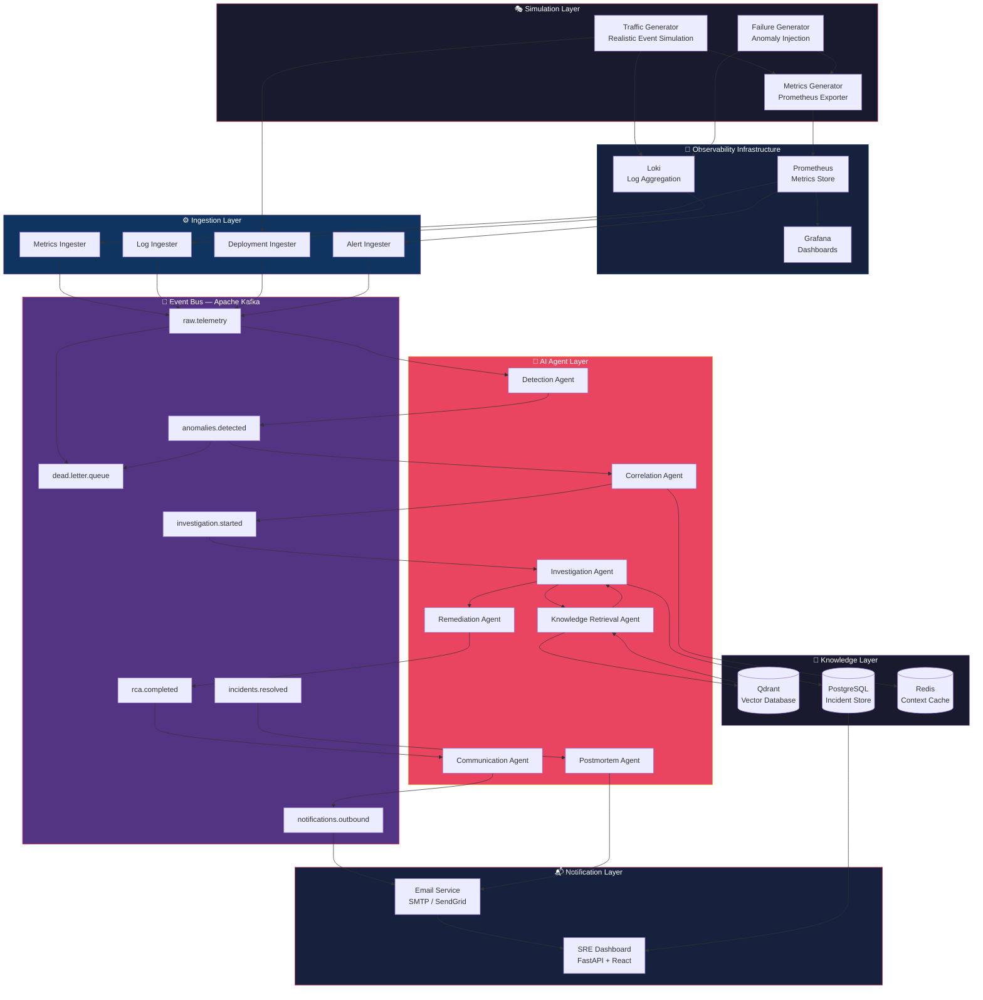
```mermaid
graph TB
    subgraph SIM["🎭 Simulation Layer"]
        TG[Traffic Generator<br/>Realistic Event Simulation]
        FG[Failure Generator<br/>Anomaly Injection]
        MG[Metrics Generator<br/>Prometheus Exporter]
    end

    subgraph INFRA["📡 Observability Infrastructure"]
        PROM[Prometheus<br/>Metrics Store]
        GRAF[Grafana<br/>Dashboards]
        LOKI[Loki<br/>Log Aggregation]
    end

    subgraph INGEST["⚙️ Ingestion Layer"]
        MI[Metrics Ingester]
        LI[Log Ingester]
        DI[Deployment Ingester]
        AI[Alert Ingester]
    end

    subgraph BUS["🚌 Event Bus — Apache Kafka"]
        T_RAW[raw.telemetry]
        T_ANOM[anomalies.detected]
        T_INVEST[investigation.started]
        T_RCA[rca.completed]
        T_NOTIF[notifications.outbound]
        T_RESOL[incidents.resolved]
        DLQ[dead.letter.queue]
    end

    subgraph AGENTS["🤖 AI Agent Layer"]
        DET[Detection Agent]
        CORR[Correlation Agent]
        INV[Investigation Agent]
        KR[Knowledge Retrieval Agent]
        REM[Remediation Agent]
        COMM[Communication Agent]
        POST[Postmortem Agent]
    end

    subgraph KNOWLEDGE["🧠 Knowledge Layer"]
        VDB[(Qdrant<br/>Vector Database)]
        PG[(PostgreSQL<br/>Incident Store)]
        REDIS[(Redis<br/>Context Cache)]
    end

    subgraph NOTIF["📬 Notification Layer"]
        EMAIL[Email Service<br/>SMTP / SendGrid]
        DASH[SRE Dashboard<br/>FastAPI + React]
    end

    TG --> MG
    FG --> MG
    MG --> PROM
    PROM --> GRAF
    TG --> LOKI
    FG --> LOKI

    PROM --> MI
    LOKI --> LI
    TG --> DI
    PROM --> AI

    MI --> T_RAW
    LI --> T_RAW
    DI --> T_RAW
    AI --> T_RAW

    T_RAW --> DET
    DET --> T_ANOM
    T_ANOM --> CORR
    CORR --> T_INVEST
    T_INVEST --> INV
    INV --> KR
    KR --> VDB
    KR --> INV
    INV --> REM
    REM --> T_RCA
    T_RCA --> COMM
    COMM --> T_NOTIF
    T_NOTIF --> EMAIL
    T_RESOL --> POST
    POST --> EMAIL

    INV --> PG
    CORR --> REDIS
    VDB --> KR

    EMAIL --> DASH
    PG --> DASH

    T_RAW --> DLQ
    T_ANOM --> DLQ

    style SIM fill:#1a1a2e,stroke:#e94560,color:#fff
    style INFRA fill:#16213e,stroke:#0f3460,color:#fff
    style INGEST fill:#0f3460,stroke:#533483,color:#fff
    style BUS fill:#533483,stroke:#e94560,color:#fff
    style AGENTS fill:#e94560,stroke:#f5a623,color:#fff
    style KNOWLEDGE fill:#1a1a2e,stroke:#533483,color:#fff
    style NOTIF fill:#16213e,stroke:#e94560,color:#fff
```

### 4.2 Technology Stack Decisions

| Layer | Technology | Rationale |
|-------|-----------|-----------|
| **LLM** | Anthropic Claude claude-sonnet-4-6 | Best-in-class reasoning, tool use, structured output |
| **Event Bus** | Apache Kafka | Durability, replay, partitioning, ecosystem maturity |
| **Vector DB** | Qdrant | Local-first, Docker-native, rich filtering, fast cosine search |
| **Metrics** | Prometheus + Grafana | Industry standard, vast ecosystem, alerting rules |
| **Logs** | Loki + Promtail | Grafana-native, label-based, low overhead |
| **Relational Store** | PostgreSQL | Incident records, audit logs, structured metadata |
| **Cache** | Redis | Agent context sharing, deduplication locks, rate limiting |
| **Embeddings** | `text-embedding-3-large` (OpenAI) or `claude-3-haiku` | High quality, 3072 dimensions, cost-effective |
| **Orchestration** | Docker Compose | Zero-dependency local demo |
| **Agent Framework** | Custom with Claude Tool Use | Avoids LangChain abstraction overhead |
| **Dashboard** | FastAPI + minimal React | Observable agent activity in real-time |

#### Why Kafka over RabbitMQ

Kafka's log-based storage enables **event replay** — a critical capability for incident investigation. When an incident is declared, the correlation agent can replay the last 30 minutes of telemetry from Kafka's offset history. RabbitMQ deletes messages on consumption, making this pattern impossible. Kafka also provides ordered partitioned streams per topic, enabling temporal correlation across event types.

#### Why Qdrant over Pinecone/Weaviate

Qdrant runs entirely in Docker with zero external dependencies — essential for a portfolio demo that must work offline. Its filtering API allows combining vector similarity with exact metadata filters (e.g., "find similar incidents for service `payment-service` in the last 6 months"), which is precisely the hybrid retrieval pattern needed for incident search. Weaviate has a heavier footprint; Pinecone is cloud-only.

#### Why Multi-Agent over Single Agent

A single monolithic agent handling all phases — detection, correlation, investigation, remediation — would have an unmanageable context window, unpredictable latency, and no parallelism. Specialized agents enable:

- **Parallel execution**: Correlation and Knowledge Retrieval can run concurrently
- **Independent scaling**: Detection agent processes every event; Postmortem agent fires rarely
- **Failure isolation**: A bug in the Remediation agent doesn't break Detection
- **Observability**: Each agent's inputs/outputs are discrete, traceable events on Kafka

---

## 5. Component Design

### 5.1 Component Diagram

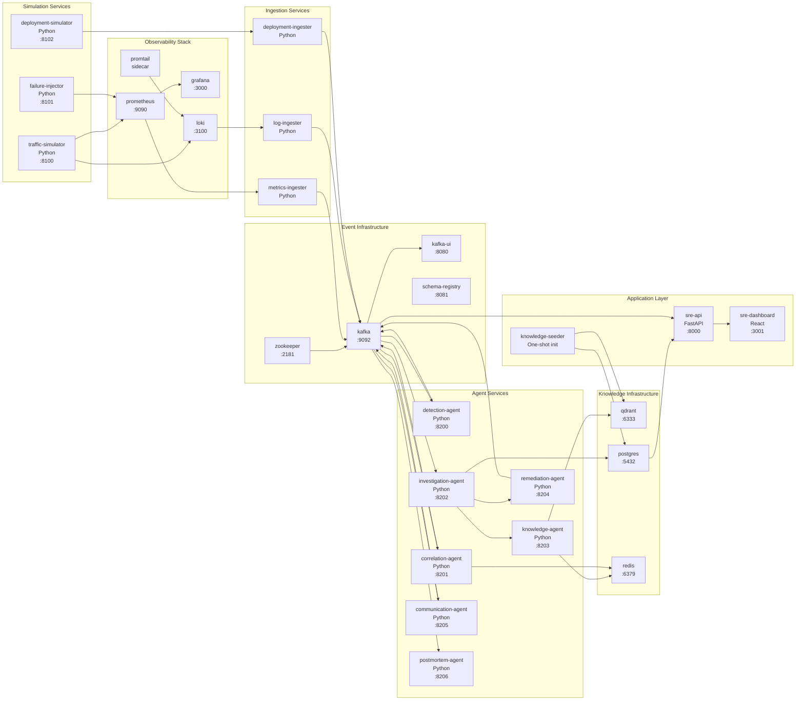
```mermaid
graph LR
    subgraph "Simulation Services"
        TS[traffic-simulator<br/>Python<br/>:8100]
        FS[failure-injector<br/>Python<br/>:8101]
        DS[deployment-simulator<br/>Python<br/>:8102]
    end

    subgraph "Observability Stack"
        PM[prometheus<br/>:9090]
        GF[grafana<br/>:3000]
        LK[loki<br/>:3100]
        PT[promtail<br/>sidecar]
    end

    subgraph "Event Infrastructure"
        ZK[zookeeper<br/>:2181]
        KF[kafka<br/>:9092]
        KUI[kafka-ui<br/>:8080]
        SR[schema-registry<br/>:8081]
    end

    subgraph "Knowledge Infrastructure"
        QD[qdrant<br/>:6333]
        PG[postgres<br/>:5432]
        RD[redis<br/>:6379]
    end

    subgraph "Ingestion Services"
        MI[metrics-ingester<br/>Python]
        LI[log-ingester<br/>Python]
        DI[deployment-ingester<br/>Python]
    end

    subgraph "Agent Services"
        DA[detection-agent<br/>Python<br/>:8200]
        CA[correlation-agent<br/>Python<br/>:8201]
        IA[investigation-agent<br/>Python<br/>:8202]
        KA[knowledge-agent<br/>Python<br/>:8203]
        RA[remediation-agent<br/>Python<br/>:8204]
        CMA[communication-agent<br/>Python<br/>:8205]
        PA[postmortem-agent<br/>Python<br/>:8206]
    end

    subgraph "Application Layer"
        API[sre-api<br/>FastAPI<br/>:8000]
        UI[sre-dashboard<br/>React<br/>:3001]
        KS[knowledge-seeder<br/>One-shot init]
    end

    TS --> PM
    FS --> PM
    PM --> GF
    TS --> LK
    PT --> LK

    ZK --> KF
    KF --> KUI

    KS --> QD
    KS --> PG

    PM --> MI
    LK --> LI
    DS --> DI

    MI --> KF
    LI --> KF
    DI --> KF

    KF --> DA
    DA --> KF
    KF --> CA
    CA --> KF
    KF --> IA
    IA --> KA
    KA --> QD
    KA --> RD
    IA --> RA
    RA --> KF
    KF --> CMA
    CMA --> KF
    KF --> PA

    IA --> PG
    CA --> RD

    PG --> API
    KF --> API
    API --> UI
```

### 5.2 Service Inventory

| Service | Role | Ports | Replicas |
|---------|------|-------|----------|
| `traffic-simulator` | Generates realistic API/service traffic | 8100 | 1 |
| `failure-injector` | Injects anomalies on schedule | 8101 | 1 |
| `deployment-simulator` | Simulates CI/CD events | 8102 | 1 |
| `prometheus` | Scrapes and stores metrics | 9090 | 1 |
| `grafana` | Metrics visualization | 3000 | 1 |
| `loki` | Log aggregation | 3100 | 1 |
| `promtail` | Log shipper sidecar | — | 1 |
| `zookeeper` | Kafka coordination | 2181 | 1 |
| `kafka` | Event bus | 9092 | 1 |
| `schema-registry` | Avro schema management | 8081 | 1 |
| `kafka-ui` | Kafka management UI | 8080 | 1 |
| `qdrant` | Vector database | 6333, 6334 | 1 |
| `postgres` | Incident and audit store | 5432 | 1 |
| `redis` | Agent context cache | 6379 | 1 |
| `metrics-ingester` | Prometheus → Kafka | — | 1 |
| `log-ingester` | Loki → Kafka | — | 1 |
| `deployment-ingester` | CI events → Kafka | — | 1 |
| `detection-agent` | Anomaly detection | 8200 | 1 |
| `correlation-agent` | Signal correlation | 8201 | 1 |
| `investigation-agent` | Root cause analysis | 8202 | 1 |
| `knowledge-agent` | Vector retrieval | 8203 | 1 |
| `remediation-agent` | Action plan generation | 8204 | 1 |
| `communication-agent` | Email notifications | 8205 | 1 |
| `postmortem-agent` | Report generation | 8206 | 1 |
| `sre-api` | REST API gateway | 8000 | 1 |
| `sre-dashboard` | Web UI | 3001 | 1 |
| `knowledge-seeder` | One-shot vector DB init | — | 1 (job) |

---

## 6. Event-Driven Architecture

### 6.1 Kafka Topic Design

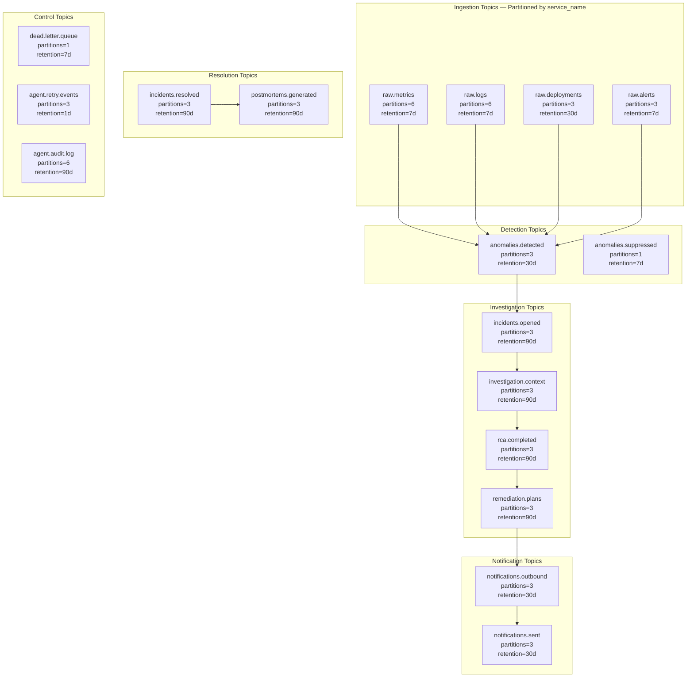
```mermaid
graph TD
    subgraph "Ingestion Topics — Partitioned by service_name"
        T1[raw.metrics<br/>partitions=6<br/>retention=7d]
        T2[raw.logs<br/>partitions=6<br/>retention=7d]
        T3[raw.deployments<br/>partitions=3<br/>retention=30d]
        T4[raw.alerts<br/>partitions=3<br/>retention=7d]
    end

    subgraph "Detection Topics"
        T5[anomalies.detected<br/>partitions=3<br/>retention=30d]
        T6[anomalies.suppressed<br/>partitions=1<br/>retention=7d]
    end

    subgraph "Investigation Topics"
        T7[incidents.opened<br/>partitions=3<br/>retention=90d]
        T8[investigation.context<br/>partitions=3<br/>retention=90d]
        T9[rca.completed<br/>partitions=3<br/>retention=90d]
        T10[remediation.plans<br/>partitions=3<br/>retention=90d]
    end

    subgraph "Notification Topics"
        T11[notifications.outbound<br/>partitions=3<br/>retention=30d]
        T12[notifications.sent<br/>partitions=3<br/>retention=30d]
    end

    subgraph "Resolution Topics"
        T13[incidents.resolved<br/>partitions=3<br/>retention=90d]
        T14[postmortems.generated<br/>partitions=3<br/>retention=90d]
    end

    subgraph "Control Topics"
        DLQ[dead.letter.queue<br/>partitions=1<br/>retention=7d]
        RETRY[agent.retry.events<br/>partitions=3<br/>retention=1d]
        AUDIT[agent.audit.log<br/>partitions=6<br/>retention=90d]
    end

    T1 --> T5
    T2 --> T5
    T3 --> T5
    T4 --> T5
    T5 --> T7
    T7 --> T8
    T8 --> T9
    T9 --> T10
    T10 --> T11
    T11 --> T12
    T13 --> T14
```

### 6.2 Event Schema Design

All events use **Avro schemas** registered with Confluent Schema Registry. This enforces schema evolution compatibility and provides self-documenting contracts between producers and consumers.

#### RawTelemetryEvent (Base Schema)

```
RawTelemetryEvent:
  event_id:         UUID           # Globally unique
  event_type:       enum           # METRIC | LOG | DEPLOYMENT | ALERT
  source_service:   string         # service name
  environment:      string         # production | staging
  timestamp:        long (epoch_ms)
  partition_key:    string         # used for Kafka partitioning (service_name)
  payload:          union          # MetricPayload | LogPayload | DeploymentPayload
  metadata:         map<string>    # Labels, tags, dimensions
```

#### AnomalyDetectedEvent

```
AnomalyDetectedEvent:
  incident_id:      UUID           # Assigned at detection time
  anomaly_type:     enum           # LATENCY_SPIKE | ERROR_RATE | CPU_SATURATION |
                                   # MEMORY_LEAK | KAFKA_LAG | DB_CONNECTIONS |
                                   # DEPENDENCY_OUTAGE | DEPLOYMENT_FAILURE
  severity:         enum           # CRITICAL | HIGH | MEDIUM | LOW
  affected_services: list<string>
  detection_time:   long
  trigger_events:   list<UUID>     # IDs of raw events that triggered detection
  anomaly_score:    float          # 0.0 - 1.0
  baseline:         AnomalyBaseline
    p50_value:      float
    p95_value:      float
    p99_value:      float
    observed_value: float
    deviation_sigma: float
  window_start:     long
  window_end:       long
```

#### IncidentContextEvent

```
IncidentContextEvent:
  incident_id:      UUID
  correlation_id:   UUID           # Groups all events for one investigation
  context_type:     enum           # METRICS | LOGS | DEPLOYMENTS | TRACES
  collected_at:     long
  time_window_minutes: int
  data_points:      list<DataPoint>
  correlation_signals: list<CorrelationSignal>
    signal_type:    string
    strength:       float          # 0.0 - 1.0
    description:    string
    evidence:       list<string>
```

#### RCACompletedEvent

```
RCACompletedEvent:
  incident_id:      UUID
  rca_id:           UUID
  generated_at:     long
  root_cause_candidates: list<RootCauseCandidates>
    rank:           int
    hypothesis:     string
    confidence:     float          # 0.0 - 1.0
    evidence:       list<string>
    similar_incidents: list<string>  # incident IDs from vector search
    runbook_refs:   list<string>
  blast_radius:     BlastRadius
    affected_services: list<string>
    estimated_user_impact: string
    estimated_revenue_impact: string
  deployment_correlation:
    correlated_deployment: DeploymentEvent | null
    correlation_confidence: float
    time_delta_minutes: int
```

#### EmailNotificationEvent

```
EmailNotificationEvent:
  notification_id:  UUID
  incident_id:      UUID
  notification_type: enum  # INCIDENT_OPENED | RCA_AVAILABLE | REMEDIATION_PLAN |
                           # STATUS_UPDATE | INCIDENT_RESOLVED | POSTMORTEM_READY
  recipients:       list<string>
  priority:         enum   # URGENT | HIGH | NORMAL
  subject:          string
  body_html:        string
  body_text:        string
  attachments:      list<Attachment>
  sent_at:          long | null
  delivery_status:  enum   # PENDING | SENT | FAILED | RETRYING
```

### 6.3 Event Flow Diagram

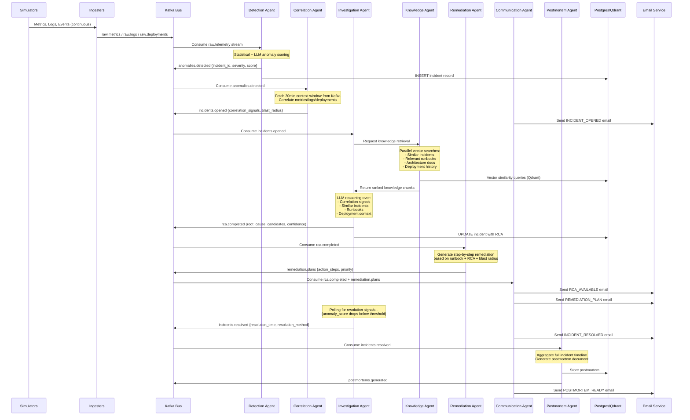
```mermaid
sequenceDiagram
    participant SIM as Simulators
    participant INGEST as Ingesters
    participant KAFKA as Kafka Bus
    participant DET as Detection Agent
    participant CORR as Correlation Agent
    participant INV as Investigation Agent
    participant KR as Knowledge Agent
    participant REM as Remediation Agent
    participant COMM as Communication Agent
    participant POST as Postmortem Agent
    participant DB as Postgres/Qdrant
    participant EMAIL as Email Service

    SIM->>INGEST: Metrics, Logs, Events (continuous)
    INGEST->>KAFKA: raw.metrics / raw.logs / raw.deployments

    KAFKA->>DET: Consume raw.telemetry stream
    Note over DET: Statistical + LLM anomaly scoring
    DET->>KAFKA: anomalies.detected {incident_id, severity, score}
    DET->>DB: INSERT incident record

    KAFKA->>CORR: Consume anomalies.detected
    Note over CORR: Fetch 30min context window from Kafka<br/>Correlate metrics/logs/deployments
    CORR->>KAFKA: incidents.opened {correlation_signals, blast_radius}
    COMM->>EMAIL: Send INCIDENT_OPENED email

    KAFKA->>INV: Consume incidents.opened
    INV->>KR: Request knowledge retrieval
    Note over KR: Parallel vector searches:<br/>- Similar incidents<br/>- Relevant runbooks<br/>- Architecture docs<br/>- Deployment history
    KR->>DB: Vector similarity queries (Qdrant)
    KR->>INV: Return ranked knowledge chunks

    Note over INV: LLM reasoning over:<br/>- Correlation signals<br/>- Similar incidents<br/>- Runbooks<br/>- Deployment context
    INV->>KAFKA: rca.completed {root_cause_candidates, confidence}
    INV->>DB: UPDATE incident with RCA

    KAFKA->>REM: Consume rca.completed
    Note over REM: Generate step-by-step remediation<br/>based on runbook + RCA + blast radius
    REM->>KAFKA: remediation.plans {action_steps, priority}

    KAFKA->>COMM: Consume rca.completed + remediation.plans
    COMM->>EMAIL: Send RCA_AVAILABLE email
    COMM->>EMAIL: Send REMEDIATION_PLAN email

    Note over INV: Polling for resolution signals...<br/>(anomaly_score drops below threshold)
    INV->>KAFKA: incidents.resolved {resolution_time, resolution_method}
    COMM->>EMAIL: Send INCIDENT_RESOLVED email

    KAFKA->>POST: Consume incidents.resolved
    Note over POST: Aggregate full incident timeline<br/>Generate postmortem document
    POST->>DB: Store postmortem
    POST->>KAFKA: postmortems.generated
    COMM->>EMAIL: Send POSTMORTEM_READY email
```

### 6.4 Retry & Dead Letter Strategy

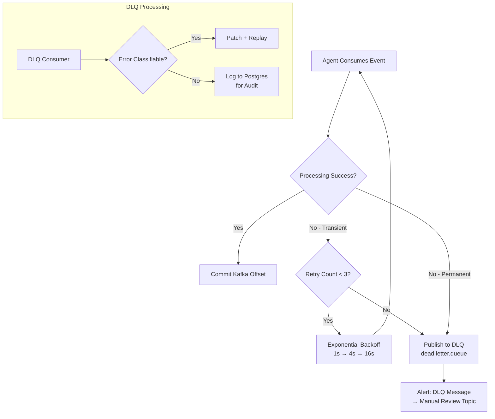
```mermaid
graph TD
    A[Agent Consumes Event] --> B{Processing Success?}
    B -->|Yes| C[Commit Kafka Offset]
    B -->|No - Transient| D{Retry Count < 3?}
    D -->|Yes| E[Exponential Backoff<br/>1s → 4s → 16s]
    E --> A
    D -->|No| F[Publish to DLQ<br/>dead.letter.queue]
    F --> G[Alert: DLQ Message<br/>→ Manual Review Topic]
    B -->|No - Permanent| F

    subgraph "DLQ Processing"
        H[DLQ Consumer]
        I{Error Classifiable?}
        J[Patch + Replay]
        K[Log to Postgres<br/>for Audit]
        H --> I
        I -->|Yes| J
        I -->|No| K
    end
```

**Retry Policy Details:**

| Error Type | Strategy | Max Retries | DLQ? |
|-----------|----------|-------------|------|
| LLM API rate limit | Exponential backoff (60s base) | 5 | No |
| LLM API error | Exponential backoff (5s base) | 3 | Yes |
| Vector DB unavailable | Fixed retry (2s) | 5 | No |
| Postgres unavailable | Fixed retry (1s) | 10 | No |
| Schema validation error | No retry | 0 | Yes |
| Kafka publish failure | Exponential backoff | 3 | Local log |

---

## 7. Multi-Agent Architecture

### 7.1 Agent Collaboration Diagram

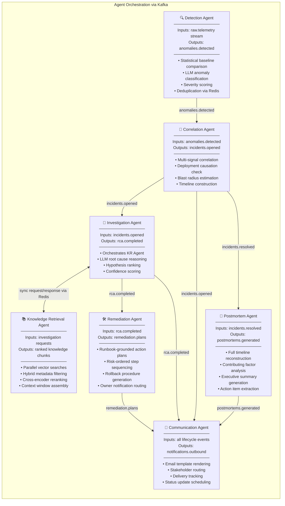
```mermaid
graph TB
    subgraph ORCH["Agent Orchestration via Kafka"]
        direction TB

        DET_A["🔍 Detection Agent<br/>────────────────<br/>Inputs: raw.telemetry stream<br/>Outputs: anomalies.detected<br/>────────────────<br/>• Statistical baseline comparison<br/>• LLM anomaly classification<br/>• Severity scoring<br/>• Deduplication via Redis"]

        CORR_A["🔗 Correlation Agent<br/>────────────────<br/>Inputs: anomalies.detected<br/>Outputs: incidents.opened<br/>────────────────<br/>• Multi-signal correlation<br/>• Deployment causation check<br/>• Blast radius estimation<br/>• Timeline construction"]

        INV_A["🧪 Investigation Agent<br/>────────────────<br/>Inputs: incidents.opened<br/>Outputs: rca.completed<br/>────────────────<br/>• Orchestrates KR Agent<br/>• LLM root cause reasoning<br/>• Hypothesis ranking<br/>• Confidence scoring"]

        KR_A["📚 Knowledge Retrieval Agent<br/>────────────────<br/>Inputs: investigation requests<br/>Outputs: ranked knowledge chunks<br/>────────────────<br/>• Parallel vector searches<br/>• Hybrid metadata filtering<br/>• Cross-encoder reranking<br/>• Context window assembly"]

        REM_A["🛠️ Remediation Agent<br/>────────────────<br/>Inputs: rca.completed<br/>Outputs: remediation.plans<br/>────────────────<br/>• Runbook-grounded action plans<br/>• Risk-ordered step sequencing<br/>• Rollback procedure generation<br/>• Owner notification routing"]

        COMM_A["📧 Communication Agent<br/>────────────────<br/>Inputs: all lifecycle events<br/>Outputs: notifications.outbound<br/>────────────────<br/>• Email template rendering<br/>• Stakeholder routing<br/>• Delivery tracking<br/>• Status update scheduling"]

        POST_A["📝 Postmortem Agent<br/>────────────────<br/>Inputs: incidents.resolved<br/>Outputs: postmortems.generated<br/>────────────────<br/>• Full timeline reconstruction<br/>• Contributing factor analysis<br/>• Executive summary generation<br/>• Action item extraction"]
    end

    DET_A -->|anomalies.detected| CORR_A
    CORR_A -->|incidents.opened| INV_A
    INV_A <-->|sync request/response via Redis| KR_A
    INV_A -->|rca.completed| REM_A
    REM_A -->|remediation.plans| COMM_A
    CORR_A -->|incidents.opened| COMM_A
    INV_A -->|rca.completed| COMM_A
    CORR_A -->|incidents.resolved| POST_A
    POST_A -->|postmortems.generated| COMM_A
```

### 7.2 Detection Agent

**Responsibility:** First-line anomaly detection over raw telemetry streams. Operates continuously with high throughput and low latency.

**Inputs:**
- `raw.metrics` topic: Prometheus metrics snapshots every 15 seconds
- `raw.logs` topic: Structured log events
- `raw.alerts` topic: Pre-computed Prometheus alert firings

**Outputs:**
- `anomalies.detected` topic: Enriched anomaly events with severity and baseline deviation
- Redis: Deduplication keys per anomaly type + service (TTL = 5 minutes)

**Detection Methodology:**

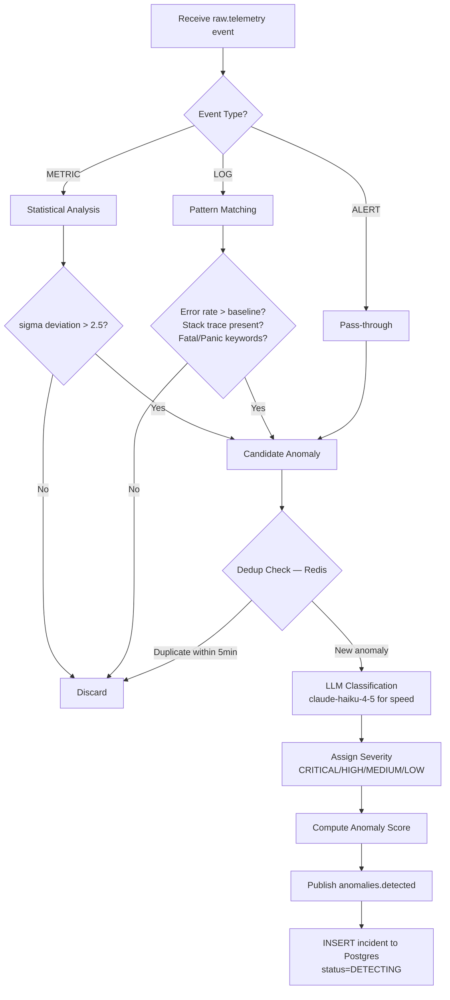
```mermaid
flowchart TD
    A[Receive raw.telemetry event] --> B{Event Type?}

    B -->|METRIC| C[Statistical Analysis]
    C --> C1{sigma deviation > 2.5?}
    C1 -->|Yes| E[Candidate Anomaly]
    C1 -->|No| Z[Discard]

    B -->|LOG| D[Pattern Matching]
    D --> D1{Error rate > baseline?<br/>Stack trace present?<br/>Fatal/Panic keywords?}
    D1 -->|Yes| E
    D1 -->|No| Z

    B -->|ALERT| F[Pass-through]
    F --> E

    E --> G{Dedup Check — Redis}
    G -->|Duplicate within 5min| Z
    G -->|New anomaly| H[LLM Classification<br/>claude-haiku-4-5 for speed]

    H --> I[Assign Severity<br/>CRITICAL/HIGH/MEDIUM/LOW]
    I --> J[Compute Anomaly Score]
    J --> K[Publish anomalies.detected]
    K --> L[INSERT incident to Postgres<br/>status=DETECTING]
```

**LLM Prompt Strategy:** Uses `claude-haiku-4-5-20251001` (fast, cheap) for classification with a structured output schema. The LLM receives: metric name, observed value, baseline statistics, recent trend, and service context. It classifies the anomaly type and confidence. This is intentionally lightweight — the heavy reasoning happens in the Investigation Agent.

**Failure Handling:**
- If LLM unavailable: Fall back to pure statistical detection (sigma > 3.0 auto-escalates)
- If Redis unavailable: Skip deduplication, accept higher duplicate rate
- Circuit breaker: If > 100 anomalies/minute detected, pause LLM calls and batch-score

**Deduplication Strategy:** Redis key `dedup:{service}:{anomaly_type}:{metric}` with 5-minute TTL. Prevents alert storms from flooding downstream agents with redundant incidents.

---

### 7.3 Correlation Agent

**Responsibility:** Transform an isolated anomaly signal into a rich incident context by correlating metrics, logs, deployment events, and related services. Establishes blast radius and causation timeline.

**Inputs:**
- `anomalies.detected` topic
- Historical Kafka replay: last 30 minutes of `raw.telemetry` for the affected service and its known dependencies

**Outputs:**
- `incidents.opened` topic with full correlation context
- `incidents.suppressed` topic (when detected as duplicate of existing open incident)

**Correlation Methodology:**

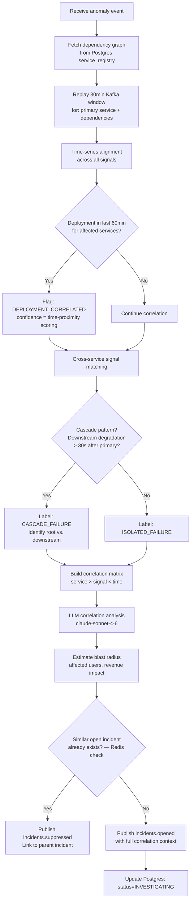
```mermaid
flowchart TD
    A[Receive anomaly event] --> B[Fetch dependency graph<br/>from Postgres service_registry]
    B --> C[Replay 30min Kafka window<br/>for: primary service + dependencies]
    C --> D[Time-series alignment<br/>across all signals]

    D --> E{Deployment in last 60min<br/>for affected services?}
    E -->|Yes| F[Flag: DEPLOYMENT_CORRELATED<br/>confidence = time-proximity scoring]
    E -->|No| G[Continue correlation]

    F --> H
    G --> H[Cross-service signal matching]

    H --> I{Cascade pattern?<br/>Downstream degradation<br/>> 30s after primary?}
    I -->|Yes| J[Label: CASCADE_FAILURE<br/>Identify root vs. downstream]
    I -->|No| K[Label: ISOLATED_FAILURE]

    J --> L[Build correlation matrix<br/>service × signal × time]
    K --> L

    L --> M[LLM correlation analysis<br/>claude-sonnet-4-6]
    M --> N[Estimate blast radius<br/>affected users, revenue impact]
    N --> O{Similar open incident<br/>already exists? — Redis check}
    O -->|Yes| P[Publish incidents.suppressed<br/>Link to parent incident]
    O -->|No| Q[Publish incidents.opened<br/>with full correlation context]
    Q --> R[Update Postgres: status=INVESTIGATING]
```

**Correlation Signals Produced:**

| Signal Type | Example | Confidence Scoring |
|------------|---------|-------------------|
| `TEMPORAL_PROXIMITY` | Deployment 12 minutes before anomaly | Decay function: `1.0 - (delta_minutes / 60)` |
| `DEPENDENCY_CASCADE` | payment-svc → order-svc latency spike | Granger causality proxy via time lag |
| `RESOURCE_CONTENTION` | CPU spike co-located with memory growth | Pearson correlation over 30min window |
| `ERROR_AMPLIFICATION` | Error rate grows faster downstream | Slope ratio comparison |
| `CONFIGURATION_DRIFT` | Config change + anomaly onset | Exact time match with manual review flag |

---

### 7.4 Investigation Agent

**Responsibility:** The central reasoning agent. Orchestrates the Knowledge Retrieval Agent, applies LLM reasoning over all collected context, and produces ranked root cause hypotheses with confidence scores.

**Inputs:**
- `incidents.opened` topic (correlation context)
- Synchronous responses from Knowledge Retrieval Agent (via Redis pub/sub)

**Outputs:**
- `rca.completed` topic with ranked hypotheses
- Postgres update with full investigation log

**Decision Logic:**

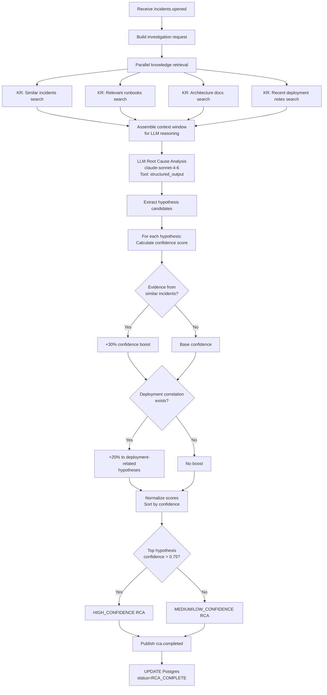
```mermaid
flowchart TD
    A[Receive incidents.opened] --> B[Build investigation request]

    B --> C[Parallel knowledge retrieval]
    C --> C1[KR: Similar incidents search]
    C --> C2[KR: Relevant runbooks search]
    C --> C3[KR: Architecture docs search]
    C --> C4[KR: Recent deployment notes search]

    C1 & C2 & C3 & C4 --> D[Assemble context window<br/>for LLM reasoning]

    D --> E[LLM Root Cause Analysis<br/>claude-sonnet-4-6<br/>Tool: structured_output]

    E --> F[Extract hypothesis candidates]
    F --> G[For each hypothesis:<br/>Calculate confidence score]

    G --> G1{Evidence from<br/>similar incidents?}
    G1 -->|Yes| G2[+30% confidence boost]
    G1 -->|No| G3[Base confidence]

    G2 & G3 --> H{Deployment correlation<br/>exists?}
    H -->|Yes| I[+20% to deployment-related<br/>hypotheses]
    H -->|No| J[No boost]

    I & J --> K[Normalize scores<br/>Sort by confidence]
    K --> L{Top hypothesis<br/>confidence > 0.75?}
    L -->|Yes| M[HIGH_CONFIDENCE RCA]
    L -->|No| N[MEDIUM/LOW_CONFIDENCE RCA]

    M & N --> O[Publish rca.completed]
    O --> P[UPDATE Postgres<br/>status=RCA_COMPLETE]
```

**LLM Prompt Architecture:**

The Investigation Agent uses a multi-turn conversation with Claude claude-sonnet-4-6 with the following tool definitions:

- `get_similar_incidents(query, service, time_range)` — Calls KR Agent
- `get_relevant_runbooks(anomaly_type, service)` — Calls KR Agent
- `get_deployment_context(service, time_window)` — Queries Postgres
- `get_service_dependencies(service)` — Queries service registry
- `calculate_confidence(hypothesis, evidence)` — Internal scoring function
- `submit_rca(candidates, blast_radius)` — Finalizes and publishes

The agent is instructed to reason step-by-step (chain-of-thought), use tools to gather evidence before concluding, and output structured RCA with explicit confidence reasoning.

---

### 7.5 Knowledge Retrieval Agent

**Responsibility:** Interface to the Qdrant vector database. Performs parallel, hybrid-filtered vector searches and assembles ranked knowledge chunks for the Investigation Agent.

**Inputs:**
- Synchronous requests from Investigation Agent via Redis pub/sub
- Query types: `INCIDENT_SIMILARITY`, `RUNBOOK_LOOKUP`, `ARCHITECTURE_CONTEXT`, `DEPLOYMENT_NOTES`

**Outputs:**
- Ranked list of knowledge chunks with relevance scores
- Source attribution metadata (collection, document_id, chunk_id)

**Retrieval Strategy:**

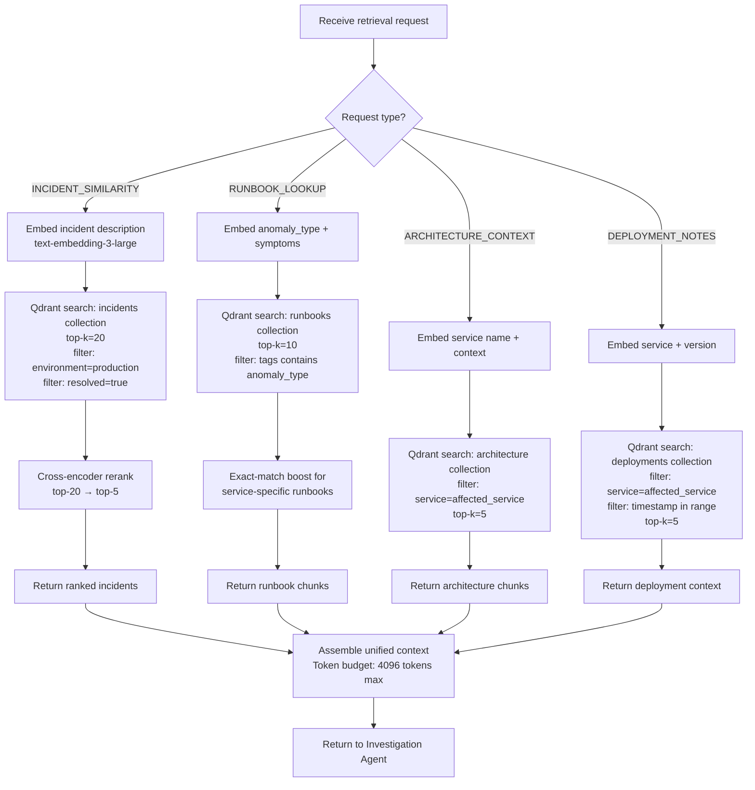
```mermaid
flowchart TD
    A[Receive retrieval request] --> B{Request type?}

    B -->|INCIDENT_SIMILARITY| C[Embed incident description<br/>text-embedding-3-large]
    C --> D[Qdrant search: incidents collection<br/>top-k=20<br/>filter: environment=production<br/>filter: resolved=true]
    D --> E[Cross-encoder rerank<br/>top-20 → top-5]
    E --> F[Return ranked incidents]

    B -->|RUNBOOK_LOOKUP| G[Embed anomaly_type + symptoms]
    G --> H[Qdrant search: runbooks collection<br/>top-k=10<br/>filter: tags contains anomaly_type]
    H --> I[Exact-match boost for<br/>service-specific runbooks]
    I --> J[Return runbook chunks]

    B -->|ARCHITECTURE_CONTEXT| K[Embed service name + context]
    K --> L[Qdrant search: architecture collection<br/>filter: service=affected_service<br/>top-k=5]
    L --> M[Return architecture chunks]

    B -->|DEPLOYMENT_NOTES| N[Embed service + version]
    N --> O[Qdrant search: deployments collection<br/>filter: service=affected_service<br/>filter: timestamp in range<br/>top-k=5]
    O --> P[Return deployment context]

    F & J & M & P --> Q[Assemble unified context<br/>Token budget: 4096 tokens max]
    Q --> R[Return to Investigation Agent]
```

**Embedding Strategy:**

- **Model:** `text-embedding-3-large` (3072 dimensions) for primary embeddings
- **Query Embeddings:** Generated at query time using the same model (no asymmetric encoding needed for these document types)
- **Batch Ingestion:** Embeddings generated in batches of 100 chunks during knowledge seeding

**Reranking:**

A cross-encoder model (`cross-encoder/ms-marco-MiniLM-L-6-v2` via HuggingFace, running locally in Docker) re-scores the top-20 candidates by jointly encoding the query and each candidate. This corrects for the approximate nature of vector similarity and lifts precision from ~60% to ~85% for top-3 results.

---

### 7.6 Remediation Agent

**Responsibility:** Generate concrete, actionable remediation plans grounded in retrieved runbooks and root cause analysis. Produces ordered action steps with risk levels and rollback procedures.

**Inputs:**
- `rca.completed` topic
- Knowledge Retrieval Agent (runbook chunks for confirmed root cause)

**Outputs:**
- `remediation.plans` topic

**Remediation Plan Structure:**

```
RemediationPlan:
  incident_id:        UUID
  root_cause:         string (from top RCA hypothesis)
  confidence:         float
  action_steps:
    - step_id:        int
      priority:       IMMEDIATE | WITHIN_15MIN | WITHIN_1HOUR
      action:         string (human-readable instruction)
      rationale:      string (why this step)
      risk_level:     LOW | MEDIUM | HIGH
      rollback:       string (how to undo if this makes things worse)
      owner:          string (team or role responsible)
      expected_outcome: string
  escalation_path:    list<string>
  runbook_references: list<string>
  estimated_resolution_time: string
```

**Decision Logic:** The agent uses retrieved runbooks as grounding — it does not invent steps from scratch. Each action step must be traceable to either: (a) a runbook procedure, (b) a resolved similar incident's resolution steps, or (c) general SRE best practices with explicit labeling.

---

### 7.7 Communication Agent

**Responsibility:** Multi-channel notification dispatch at each stage of the incident lifecycle. Manages recipient routing, email template rendering, and delivery tracking.

**Inputs:**
- Multiple topics: `anomalies.detected`, `incidents.opened`, `rca.completed`, `remediation.plans`, `incidents.resolved`, `postmortems.generated`

**Outputs:**
- `notifications.outbound` → Email Service
- `notifications.sent` (confirmed delivery log)

**Notification Matrix:**

| Trigger Event | Email Type | Recipients | Priority | Delay |
|--------------|-----------|-----------|---------|-------|
| `anomalies.detected` (CRITICAL) | INCIDENT_OPENED | On-call + Management | URGENT | Immediate |
| `incidents.opened` | INCIDENT_CONTEXT | On-call + Service Owner | HIGH | Immediate |
| `rca.completed` | RCA_AVAILABLE | On-call + Service Owner | HIGH | Immediate |
| `remediation.plans` | REMEDIATION_PLAN | On-call | HIGH | Immediate |
| `incidents.resolved` | INCIDENT_RESOLVED | All stakeholders | NORMAL | Immediate |
| `postmortems.generated` | POSTMORTEM_READY | Team + Management | NORMAL | Immediate |

---

### 7.8 Postmortem Agent

**Responsibility:** Reconstruct a complete incident narrative from dispersed events and generate a structured postmortem document suitable for sharing with leadership and engineering teams.

**Inputs:**
- `incidents.resolved` topic
- Postgres: Full incident timeline query
- Postgres: All RCA candidates, correlation signals, remediation steps

**Outputs:**
- Structured postmortem document (Markdown + HTML)
- `postmortems.generated` topic (triggers Communication Agent)
- Postgres: Store postmortem with linking to incident

**Postmortem Generation:**

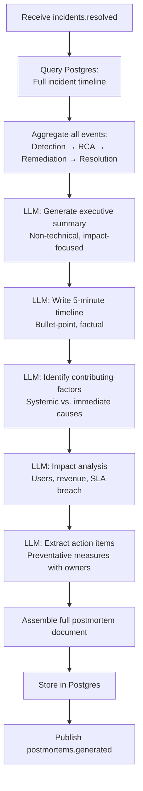
```mermaid
flowchart TD
    A[Receive incidents.resolved] --> B[Query Postgres:<br/>Full incident timeline]
    B --> C[Aggregate all events:<br/>Detection → RCA → Remediation → Resolution]
    C --> D[LLM: Generate executive summary<br/>Non-technical, impact-focused]
    D --> E[LLM: Write 5-minute timeline<br/>Bullet-point, factual]
    E --> F[LLM: Identify contributing factors<br/>Systemic vs. immediate causes]
    F --> G[LLM: Impact analysis<br/>Users, revenue, SLA breach]
    G --> H[LLM: Extract action items<br/>Preventative measures with owners]
    H --> I[Assemble full postmortem document]
    I --> J[Store in Postgres]
    J --> K[Publish postmortems.generated]
```

---

## 8. Vector Store & Knowledge Architecture

### 8.1 Qdrant Collection Design

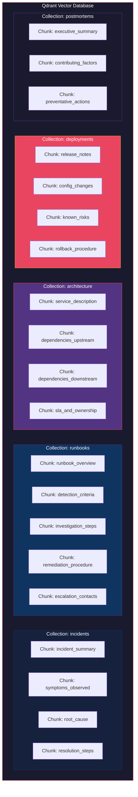
```mermaid
graph TB
    subgraph QDRANT["Qdrant Vector Database"]
        subgraph C1["Collection: incidents"]
            direction LR
            I1[Chunk: incident_summary]
            I2[Chunk: symptoms_observed]
            I3[Chunk: root_cause]
            I4[Chunk: resolution_steps]
        end

        subgraph C2["Collection: runbooks"]
            direction LR
            R1[Chunk: runbook_overview]
            R2[Chunk: detection_criteria]
            R3[Chunk: investigation_steps]
            R4[Chunk: remediation_procedure]
            R5[Chunk: escalation_contacts]
        end

        subgraph C3["Collection: architecture"]
            direction LR
            A1[Chunk: service_description]
            A2[Chunk: dependencies_upstream]
            A3[Chunk: dependencies_downstream]
            A4[Chunk: sla_and_ownership]
        end

        subgraph C4["Collection: deployments"]
            direction LR
            D1[Chunk: release_notes]
            D2[Chunk: config_changes]
            D3[Chunk: known_risks]
            D4[Chunk: rollback_procedure]
        end

        subgraph C5["Collection: postmortems"]
            direction LR
            P1[Chunk: executive_summary]
            P2[Chunk: contributing_factors]
            P3[Chunk: preventative_actions]
        end
    end

    style QDRANT fill:#1a1a2e,stroke:#e94560,color:#fff
    style C1 fill:#16213e,stroke:#0f3460,color:#fff
    style C2 fill:#0f3460,stroke:#533483,color:#fff
    style C3 fill:#533483,stroke:#e94560,color:#fff
    style C4 fill:#e94560,stroke:#f5a623,color:#fff
    style C5 fill:#1a1a2e,stroke:#533483,color:#fff
```

### 8.2 Collection Specifications

#### Collection: `incidents`

**Purpose:** Enable semantic similarity search over historical incidents. When a new anomaly is detected, retrieve the 5 most similar past incidents to guide root cause reasoning.

**What is stored:** Each historical incident is decomposed into 4 semantic chunks:

| Chunk Type | Content | Why Chunked Separately |
|-----------|---------|----------------------|
| `incident_summary` | High-level description, severity, affected services | Enables broad similarity matching |
| `symptoms_observed` | Specific metrics values, error messages, log patterns | Enables symptom-specific matching |
| `root_cause` | Confirmed root cause statement | Enables RCA retrieval by symptom |
| `resolution_steps` | What fixed it, how long it took | Enables remediation retrieval |

**Metadata Fields (Qdrant Payload):**

```
incident_id:        string   # UUID for linking chunks
service_name:       string   # Primary affected service
severity:           string   # CRITICAL | HIGH | MEDIUM
environment:        string   # production | staging
anomaly_type:       string   # Type enum
occurred_at:        int      # Unix timestamp (enables time-range filters)
resolved_at:        int
mttr_minutes:       int
root_cause_category: string  # DEPLOYMENT | CONFIG | INFRASTRUCTURE | APPLICATION
tags:               list<string>
```

**Chunking Strategy:**
- Fixed-size chunking is inappropriate for incidents (too rigid for narrative text)
- Use **semantic chunking**: split on section headers (`## Symptoms`, `## Root Cause`)
- Chunk size: 256–512 tokens
- Overlap: 50 tokens between adjacent chunks of the same document

**Retrieval Strategy:**
- Query embedding: `text-embedding-3-large` over `"{anomaly_type} {service} {symptoms_description}"`
- Filter: `environment=production AND resolved=true AND occurred_at > (now - 365 days)`
- top-k: 20 → rerank → return top 5
- Return all 4 chunk types for matched incident IDs (grouped retrieval)

---

#### Collection: `runbooks`

**Purpose:** Surface actionable operational procedures during investigation. Each runbook addresses a specific failure mode.

**What is stored:** Each runbook procedure (e.g., "High Memory Usage on Java Services", "Database Connection Pool Exhaustion") is chunked by procedure step group.

**Metadata Fields:**

```
runbook_id:         string
title:              string
anomaly_types:      list<string>   # Which anomaly types this covers
services:           list<string>   # Service-specific if applicable
severity_levels:    list<string>
tags:               list<string>
last_updated:       int
version:            string
```

**Chunking Strategy:**
- Split on procedure step headers (`### Step 1:`, `### Investigation:`)
- Preserve step numbering in chunk metadata for ordering
- Each chunk: 256–384 tokens

**Retrieval Strategy:**
- Query: `"{anomaly_type} {service} {top_symptom_description}"`
- Filter: `anomaly_types contains {detected_anomaly_type}`
- Boost: chunks from service-specific runbooks get +0.15 score boost

---

#### Collection: `architecture`

**Purpose:** Ground LLM reasoning in actual system topology. Without this, the LLM hallucinates dependency relationships.

**What is stored:**
- Service documentation (description, tech stack, criticality)
- Dependency maps (upstream/downstream service lists)
- SLA contracts (latency budgets, error rate thresholds)
- Ownership metadata (team, on-call rotation, Slack channel)

**Metadata Fields:**

```
service_name:       string
team_owner:         string
criticality:        string   # P0 | P1 | P2
sla_p99_latency_ms: int
sla_error_rate_pct: float
on_call_rotation:   string
slack_channel:      string
dependency_depth:   int      # How many services downstream
```

**Retrieval Strategy:**
- Always retrieved for the affected service by exact filter: `service_name={affected_service}`
- Plus dependency graph traversal: retrieve docs for all first-degree dependencies
- This ensures the Investigation Agent has full topological context

---

#### Collection: `deployments`

**Purpose:** Support deployment-correlation hypothesis. If a deployment happened 20 minutes before an incident, its release notes and known risks are critical evidence.

**What is stored:** Release notes, configuration change manifests, known risks stated at deploy time, and rollback procedures.

**Metadata Fields:**

```
deployment_id:      string
service_name:       string
version:            string
deployed_at:        int      # Critical for time-range filtering
environment:        string
deployed_by:        string
change_type:        string   # CODE | CONFIG | INFRASTRUCTURE | DEPENDENCY
known_risks:        list<string>
requires_migration: bool
```

**Retrieval Strategy:**
- Filter: `service_name in {affected_services} AND deployed_at between (incident_time - 2h) AND incident_time`
- Sorted by recency (most recent deployment first)

---

#### Collection: `postmortems`

**Purpose:** Historical learning. Postmortems capture systemic patterns — root causes that recurred, preventative actions that were never implemented. This collection improves over time as new incidents resolve.

**What is stored:**
- Executive summary
- Contributing factors (systemic issues)
- Preventative action items

**Retrieval Strategy:**
- Queried by the Investigation Agent when looking for recurring patterns
- Filter: `root_cause_category={detected_category}`

---

### 8.3 Knowledge Retrieval Flow

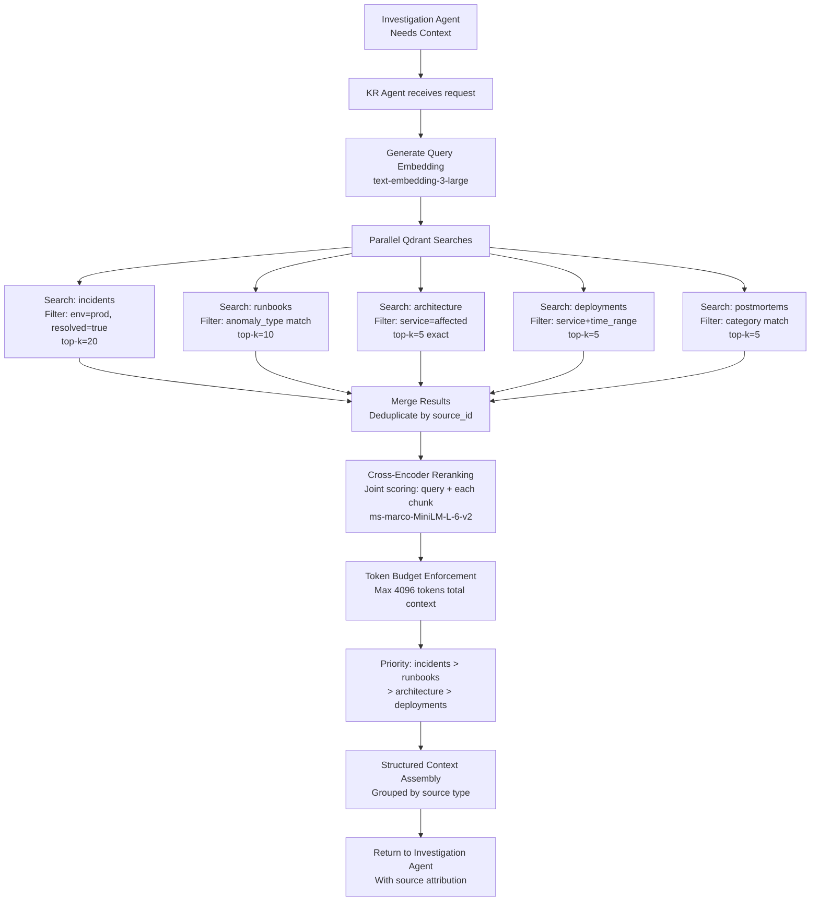
```mermaid
graph TB
    A[Investigation Agent<br/>Needs Context] --> B[KR Agent receives request]

    B --> C[Generate Query Embedding<br/>text-embedding-3-large]

    C --> D[Parallel Qdrant Searches]

    D --> D1[Search: incidents<br/>Filter: env=prod, resolved=true<br/>top-k=20]
    D --> D2[Search: runbooks<br/>Filter: anomaly_type match<br/>top-k=10]
    D --> D3[Search: architecture<br/>Filter: service=affected<br/>top-k=5 exact]
    D --> D4[Search: deployments<br/>Filter: service+time_range<br/>top-k=5]
    D --> D5[Search: postmortems<br/>Filter: category match<br/>top-k=5]

    D1 --> E[Merge Results<br/>Deduplicate by source_id]
    D2 --> E
    D3 --> E
    D4 --> E
    D5 --> E

    E --> F[Cross-Encoder Reranking<br/>Joint scoring: query + each chunk<br/>ms-marco-MiniLM-L-6-v2]

    F --> G[Token Budget Enforcement<br/>Max 4096 tokens total context]
    G --> G1[Priority: incidents > runbooks<br/>> architecture > deployments]
    G1 --> H[Structured Context Assembly<br/>Grouped by source type]

    H --> I[Return to Investigation Agent<br/>With source attribution]
```

---

## 9. Knowledge Ingestion Pipelines

### 9.1 Data Flow Diagram

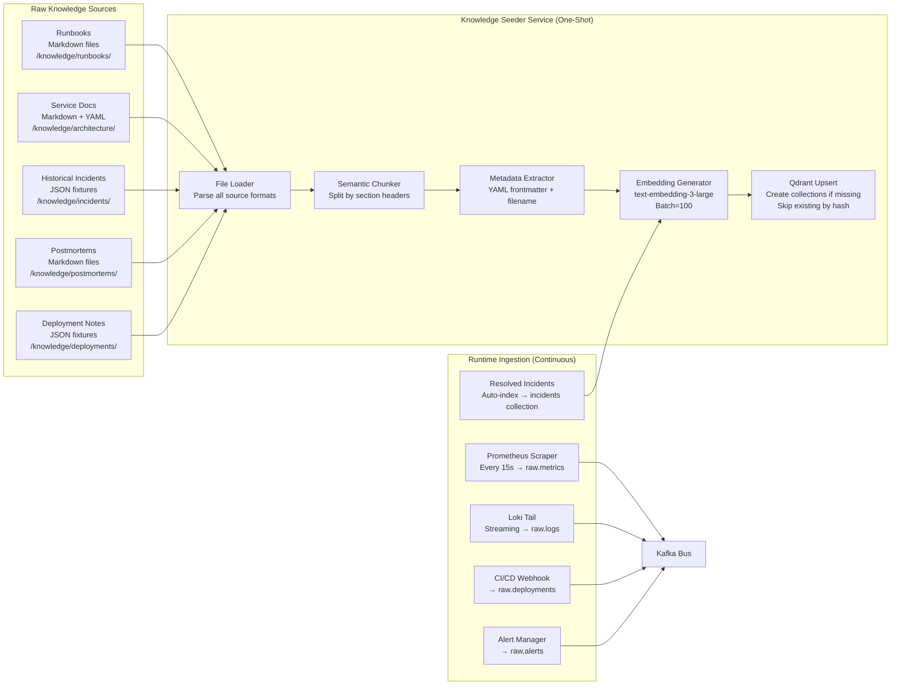
```mermaid
graph LR
    subgraph RAW["Raw Knowledge Sources"]
        RK1[Runbooks<br/>Markdown files<br/>/knowledge/runbooks/]
        RK2[Service Docs<br/>Markdown + YAML<br/>/knowledge/architecture/]
        RK3[Historical Incidents<br/>JSON fixtures<br/>/knowledge/incidents/]
        RK4[Postmortems<br/>Markdown files<br/>/knowledge/postmortems/]
        RK5[Deployment Notes<br/>JSON fixtures<br/>/knowledge/deployments/]
    end

    subgraph SEEDER["Knowledge Seeder Service (One-Shot)"]
        LOAD[File Loader<br/>Parse all source formats]
        CHUNK[Semantic Chunker<br/>Split by section headers]
        META[Metadata Extractor<br/>YAML frontmatter + filename]
        EMBED[Embedding Generator<br/>text-embedding-3-large<br/>Batch=100]
        UPSERT[Qdrant Upsert<br/>Create collections if missing<br/>Skip existing by hash]
    end

    subgraph RUNTIME["Runtime Ingestion (Continuous)"]
        PM_ING[Prometheus Scraper<br/>Every 15s → raw.metrics]
        LOG_ING[Loki Tail<br/>Streaming → raw.logs]
        DEP_ING[CI/CD Webhook<br/>→ raw.deployments]
        ALERT_ING[Alert Manager<br/>→ raw.alerts]
        NEW_INC[Resolved Incidents<br/>Auto-index → incidents collection]
    end

    RK1 & RK2 & RK3 & RK4 & RK5 --> LOAD
    LOAD --> CHUNK --> META --> EMBED --> UPSERT

    PM_ING --> KAFKA_BUS[Kafka Bus]
    LOG_ING --> KAFKA_BUS
    DEP_ING --> KAFKA_BUS
    ALERT_ING --> KAFKA_BUS
    NEW_INC --> EMBED
```

### 9.2 Simulated Knowledge Content

For the demo, the Knowledge Seeder populates realistic synthetic content:

**Runbooks (15 documents):**
- `high-latency-api.md` — P99 latency spike investigation and resolution
- `database-connection-exhaustion.md` — PostgreSQL connection pool debugging
- `kafka-consumer-lag.md` — Consumer group lag analysis and remediation
- `memory-leak-java.md` — JVM heap analysis and restart procedures
- `cpu-saturation.md` — CPU profiling and resource scaling
- `deployment-rollback.md` — Standard rollback procedures per service type
- `dependency-outage.md` — Third-party service degradation handling
- `error-rate-spike.md` — 5xx investigation workflow
- `disk-saturation.md` — Disk space emergency procedures
- `network-partition.md` — Split-brain detection and recovery

**Simulated Historical Incidents (50 records):**
Generated JSON fixtures representing 50 realistic past incidents across the simulated microservices, with varying root causes, resolutions, and timelines. These seed the `incidents` collection and provide the RAG backbone for demonstration.

---

## 10. Root Cause Analysis Workflow

### 10.1 RCA Decision Tree

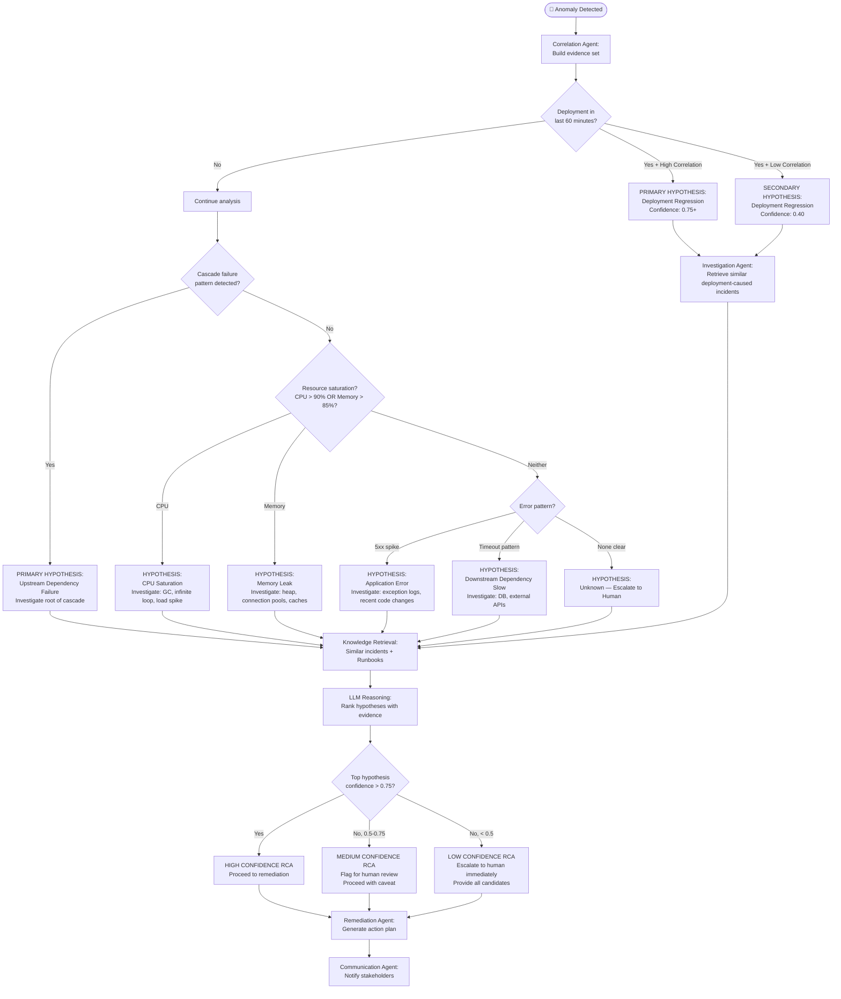
```mermaid
flowchart TD
    A([🚨 Anomaly Detected]) --> B[Correlation Agent:<br/>Build evidence set]

    B --> C{Deployment in<br/>last 60 minutes?}
    C -->|Yes + High Correlation| D[PRIMARY HYPOTHESIS:<br/>Deployment Regression<br/>Confidence: 0.75+]
    C -->|Yes + Low Correlation| E[SECONDARY HYPOTHESIS:<br/>Deployment Regression<br/>Confidence: 0.40]
    C -->|No| F[Continue analysis]

    D --> G[Investigation Agent:<br/>Retrieve similar deployment-caused incidents]
    E --> G
    F --> H{Cascade failure<br/>pattern detected?}

    H -->|Yes| I[PRIMARY HYPOTHESIS:<br/>Upstream Dependency Failure<br/>Investigate root of cascade]
    H -->|No| J{Resource saturation?<br/>CPU > 90% OR Memory > 85%?}

    J -->|CPU| K[HYPOTHESIS:<br/>CPU Saturation<br/>Investigate: GC, infinite loop, load spike]
    J -->|Memory| L[HYPOTHESIS:<br/>Memory Leak<br/>Investigate: heap, connection pools, caches]
    J -->|Neither| M{Error pattern?}

    M -->|5xx spike| N[HYPOTHESIS:<br/>Application Error<br/>Investigate: exception logs, recent code changes]
    M -->|Timeout pattern| O[HYPOTHESIS:<br/>Downstream Dependency Slow<br/>Investigate: DB, external APIs]
    M -->|None clear| P[HYPOTHESIS:<br/>Unknown — Escalate to Human]

    I & K & L & N & O & P --> Q[Knowledge Retrieval:<br/>Similar incidents + Runbooks]
    G --> Q

    Q --> R[LLM Reasoning:<br/>Rank hypotheses with evidence]
    R --> S{Top hypothesis<br/>confidence > 0.75?}

    S -->|Yes| T[HIGH CONFIDENCE RCA<br/>Proceed to remediation]
    S -->|No, 0.5-0.75| U[MEDIUM CONFIDENCE RCA<br/>Flag for human review<br/>Proceed with caveat]
    S -->|No, < 0.5| V[LOW CONFIDENCE RCA<br/>Escalate to human immediately<br/>Provide all candidates]

    T & U & V --> W[Remediation Agent:<br/>Generate action plan]
    W --> X[Communication Agent:<br/>Notify stakeholders]
```

### 10.2 Confidence Scoring Formula

```
Base confidence = vector similarity score of top similar incident

Modifiers:
  +0.20 if deployment correlation exists within 60 minutes
  +0.15 if same root_cause_category resolved successfully in top-3 similar incidents
  +0.10 if affected service is same as top similar incident
  -0.15 if no similar incidents found (score < 0.70)
  -0.10 if multiple competing hypotheses with similar scores (ambiguous)
  +0.05 if runbook exactly matches anomaly_type

Final score = clamp(base + sum(modifiers), 0.0, 1.0)
```

### 10.3 Full Incident Investigation Sequence

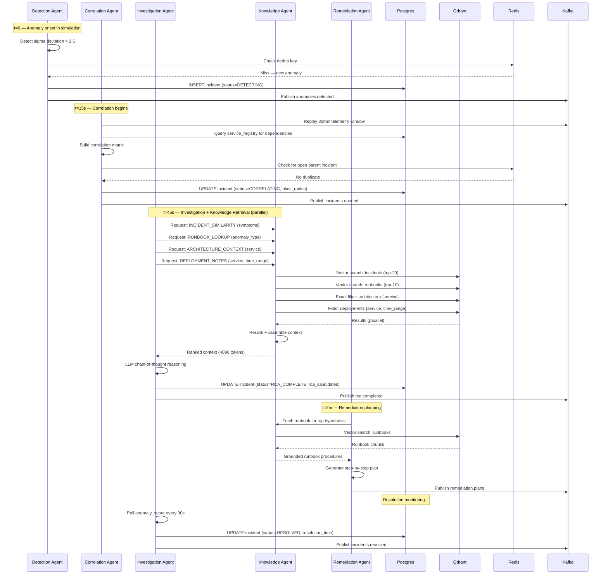
```mermaid
sequenceDiagram
    participant DA as Detection Agent
    participant CA as Correlation Agent
    participant IA as Investigation Agent
    participant KA as Knowledge Agent
    participant RA as Remediation Agent
    participant PG as Postgres
    participant QD as Qdrant
    participant RD as Redis

    Note over DA: t=0 — Anomaly onset in simulation

    DA->>DA: Detect sigma deviation > 2.5
    DA->>RD: Check dedup key
    RD-->>DA: Miss — new anomaly
    DA->>PG: INSERT incident (status=DETECTING)
    DA->>Kafka: Publish anomalies.detected

    Note over CA: t=15s — Correlation begins

    CA->>Kafka: Replay 30min telemetry window
    CA->>PG: Query service_registry for dependencies
    CA->>CA: Build correlation matrix
    CA->>RD: Check for open parent incident
    RD-->>CA: No duplicate
    CA->>PG: UPDATE incident (status=CORRELATING, blast_radius)
    CA->>Kafka: Publish incidents.opened

    Note over IA,KA: t=45s — Investigation + Knowledge Retrieval (parallel)

    IA->>KA: Request: INCIDENT_SIMILARITY {symptoms}
    IA->>KA: Request: RUNBOOK_LOOKUP {anomaly_type}
    IA->>KA: Request: ARCHITECTURE_CONTEXT {service}
    IA->>KA: Request: DEPLOYMENT_NOTES {service, time_range}

    KA->>QD: Vector search: incidents (top-20)
    KA->>QD: Vector search: runbooks (top-10)
    KA->>QD: Exact filter: architecture {service}
    KA->>QD: Filter: deployments {service, time_range}
    QD-->>KA: Results (parallel)
    KA->>KA: Rerank + assemble context
    KA-->>IA: Ranked context (4096 tokens)

    IA->>IA: LLM chain-of-thought reasoning
    IA->>PG: UPDATE incident (status=RCA_COMPLETE, rca_candidates)
    IA->>Kafka: Publish rca.completed

    Note over RA: t=2m — Remediation planning

    RA->>KA: Fetch runbook for top hypothesis
    KA->>QD: Vector search: runbooks
    QD-->>KA: Runbook chunks
    KA-->>RA: Grounded runbook procedures
    RA->>RA: Generate step-by-step plan
    RA->>Kafka: Publish remediation.plans

    Note over PG: Resolution monitoring...

    IA->>IA: Poll anomaly_score every 30s
    IA->>PG: UPDATE incident (status=RESOLVED, resolution_time)
    IA->>Kafka: Publish incidents.resolved
```

---

## 11. Notification Architecture

### 11.1 Email Notification Flow

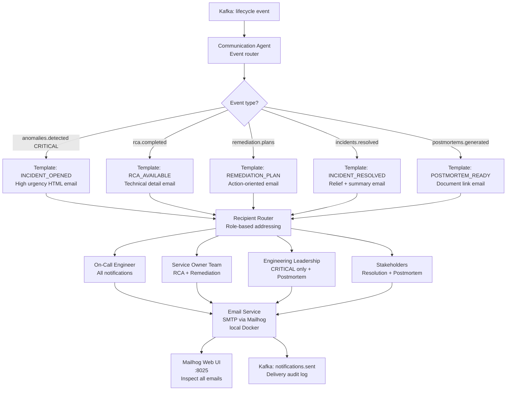
```mermaid
graph TD
    A[Kafka: lifecycle event] --> B[Communication Agent<br/>Event router]

    B --> C{Event type?}

    C -->|anomalies.detected CRITICAL| D[Template: INCIDENT_OPENED<br/>High urgency HTML email]
    C -->|rca.completed| E[Template: RCA_AVAILABLE<br/>Technical detail email]
    C -->|remediation.plans| F[Template: REMEDIATION_PLAN<br/>Action-oriented email]
    C -->|incidents.resolved| G[Template: INCIDENT_RESOLVED<br/>Relief + summary email]
    C -->|postmortems.generated| H[Template: POSTMORTEM_READY<br/>Document link email]

    D & E & F & G & H --> I[Recipient Router<br/>Role-based addressing]

    I --> I1[On-Call Engineer<br/>All notifications]
    I --> I2[Service Owner Team<br/>RCA + Remediation]
    I --> I3[Engineering Leadership<br/>CRITICAL only + Postmortem]
    I --> I4[Stakeholders<br/>Resolution + Postmortem]

    I1 & I2 & I3 & I4 --> J[Email Service<br/>SMTP via Mailhog<br/>local Docker]

    J --> K[Mailhog Web UI<br/>:8025<br/>Inspect all emails]
    J --> L[Kafka: notifications.sent<br/>Delivery audit log]
```

### 11.2 Email Templates

#### INCIDENT_OPENED Email

```
Subject: 🚨 [CRITICAL] Incident INC-{id} — {anomaly_type} on {service} — {timestamp}

---
INCIDENT ALERT
---
Incident ID:     INC-{id}
Severity:        CRITICAL
Service:         {primary_service}
Anomaly:         {anomaly_type}
Detected At:     {detection_time}
Duration So Far: {elapsed}
Affected Users:  {estimated_impact}

SYMPTOMS OBSERVED
• {symptom_1}
• {symptom_2}
• {symptom_3}

PRELIMINARY BLAST RADIUS
• Primary:    {primary_service}
• Downstream: {downstream_services}

INVESTIGATION STATUS
AI Agent investigation has been automatically initiated.
Root cause analysis is in progress.

On-call engineer has been paged: {oncall_name}

[View Incident Dashboard →] [View Grafana →]
```

#### RCA_AVAILABLE Email

```
Subject: 🔍 [INC-{id}] Root Cause Analysis Available — {confidence}% Confidence

---
ROOT CAUSE ANALYSIS
---
Incident: INC-{id} | Service: {service} | Duration: {elapsed}

TOP ROOT CAUSE HYPOTHESIS ({confidence}% confidence)
"{root_cause_description}"

SUPPORTING EVIDENCE
• {evidence_1}
• {evidence_2}
• {evidence_3}

SIMILAR HISTORICAL INCIDENTS
• INC-{similar_1}: "{similar_summary_1}" — Resolved in {mttr_1}
• INC-{similar_2}: "{similar_summary_2}" — Resolved in {mttr_2}

DEPLOYMENT CORRELATION
{deployment_correlation_statement}

CONFIDENCE BREAKDOWN
  Evidence from similar incidents:    +30%
  Deployment correlation:             +20%
  Runbook pattern match:              +15%
  ─────────────────────────────────────
  Final confidence:                   {confidence}%

[View Full RCA →] [View Remediation Plan →]
```

#### REMEDIATION_PLAN Email

```
Subject: 🛠️ [INC-{id}] Remediation Plan Ready — {steps} steps identified

---
REMEDIATION PLAN
---
Based on root cause: "{root_cause}"
Estimated resolution time: {estimated_time}

IMMEDIATE ACTIONS (< 5 minutes)
  ☐ Step 1: {action_1}
    Risk: {risk_1} | Owner: {owner_1}
    Expected: {outcome_1}
    Rollback: {rollback_1}

  ☐ Step 2: {action_2}
    ...

SHORT-TERM ACTIONS (< 30 minutes)
  ☐ Step 3: {action_3}
    ...

ESCALATION PATH
If steps 1-2 do not resolve within 15 minutes:
→ Escalate to: {escalation_contact}

RUNBOOK REFERENCE
{runbook_title}: {runbook_url}

[Mark Resolved →] [View Dashboard →]
```

#### POSTMORTEM_READY Email

```
Subject: 📋 [INC-{id}] Postmortem Ready — {service} {anomaly_type} on {date}

---
POSTMORTEM: {incident_title}
---
Incident: INC-{id}
Duration: {detection_time} → {resolution_time} ({total_duration})
Severity: {severity}
MTTR: {mttr}
User Impact: {user_impact}

EXECUTIVE SUMMARY
{executive_summary_paragraph}

TIMELINE (KEY EVENTS)
{detection_time}  Anomaly detected by SRE Agent
{+Xmin}           Root cause identified: {root_cause}
{+Xmin}           Remediation steps applied
{resolution_time} Service restored to normal

ROOT CAUSE
{root_cause_statement}

TOP CONTRIBUTING FACTORS
1. {factor_1}
2. {factor_2}

ACTION ITEMS
  • {action_item_1} — Owner: {owner} — Due: {due_date}
  • {action_item_2} — Owner: {owner} — Due: {due_date}

[Read Full Postmortem →] [View Incident Timeline →]
```

### 11.3 Local Email Infrastructure (Mailhog)

For the local demo, all email is captured by **Mailhog** — an SMTP server with a web UI that runs in Docker. No real email is sent. Engineers can view all generated emails at `http://localhost:8025` in a realistic inbox-style interface.

This is intentional: it demonstrates the email design without requiring real SMTP credentials.

---

## 12. Postmortem Architecture

### 12.1 Postmortem Document Structure

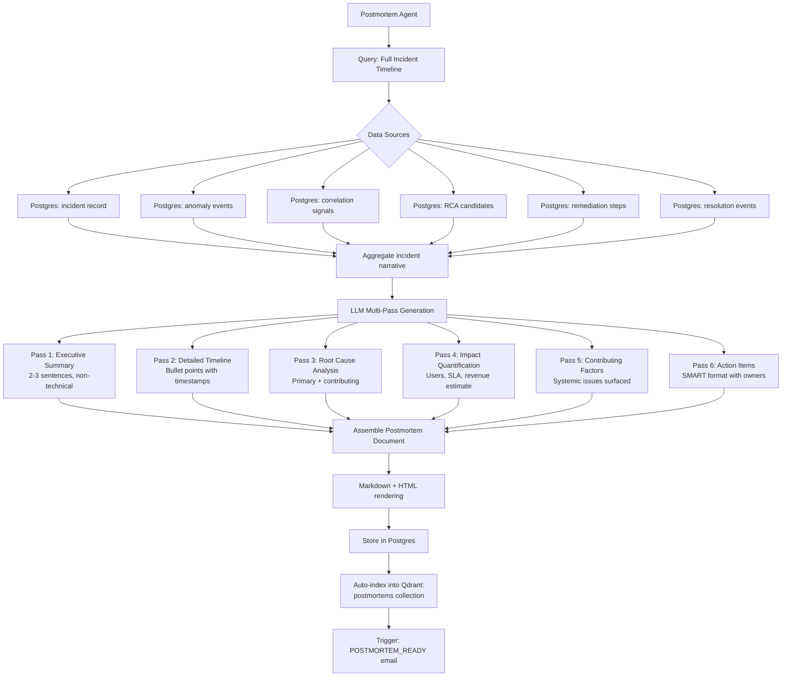
```mermaid
graph TD
    A[Postmortem Agent] --> B[Query: Full Incident Timeline]
    B --> C{Data Sources}
    C --> C1[Postgres: incident record]
    C --> C2[Postgres: anomaly events]
    C --> C3[Postgres: correlation signals]
    C --> C4[Postgres: RCA candidates]
    C --> C5[Postgres: remediation steps]
    C --> C6[Postgres: resolution events]

    C1 & C2 & C3 & C4 & C5 & C6 --> D[Aggregate incident narrative]

    D --> E[LLM Multi-Pass Generation]

    E --> E1[Pass 1: Executive Summary<br/>2-3 sentences, non-technical]
    E --> E2[Pass 2: Detailed Timeline<br/>Bullet points with timestamps]
    E --> E3[Pass 3: Root Cause Analysis<br/>Primary + contributing]
    E --> E4[Pass 4: Impact Quantification<br/>Users, SLA, revenue estimate]
    E --> E5[Pass 5: Contributing Factors<br/>Systemic issues surfaced]
    E --> E6[Pass 6: Action Items<br/>SMART format with owners]

    E1 & E2 & E3 & E4 & E5 & E6 --> F[Assemble Postmortem Document]

    F --> G[Markdown + HTML rendering]
    G --> H[Store in Postgres]
    H --> I[Auto-index into Qdrant:<br/>postmortems collection]
    I --> J[Trigger: POSTMORTEM_READY email]
```

### 12.2 Automated Postmortem Template

```markdown
# Postmortem: {Incident Title}
**Date:** {date} | **Duration:** {duration} | **Severity:** {severity} | **MTTR:** {mttr}
**Author:** SRE Agent (Automated) | **Review Status:** Pending Human Review

---

## Executive Summary
{2-3 sentence executive summary written in plain language for leadership}

---

## Impact
| Dimension | Value |
|-----------|-------|
| User Impact | {estimated_users_affected} |
| SLA Breach | {yes/no, SLA target vs actual} |
| Error Rate Peak | {peak_error_rate}% |
| Latency Peak (p99) | {peak_latency}ms |
| Revenue Impact (Est.) | {revenue_estimate} |

---

## Timeline
| Time | Event |
|------|-------|
| {t+0} | Anomaly onset (first signal) |
| {t+Xm} | Detected by SRE Agent |
| {t+Xm} | Correlation completed, {N} signals identified |
| {t+Xm} | Root cause identified ({confidence}% confidence) |
| {t+Xm} | Remediation steps generated |
| {t+Xm} | On-call engineer engaged |
| {t+Xm} | Remediation applied |
| {t+Xm} | Service restored |

---

## Root Cause
**Primary:** {primary_root_cause_statement}

**Evidence:**
- {evidence_1}
- {evidence_2}

---

## Contributing Factors
1. {contributing_factor_1} — Systemic
2. {contributing_factor_2} — Process
3. {contributing_factor_3} — Technical Debt

---

## What Went Well
- SRE Agent detected anomaly within {detection_latency}
- Root cause identified in {rca_duration}
- Similar incidents surfaced: {similar_incident_list}

---

## What Could Be Improved
- {improvement_1}
- {improvement_2}

---

## Action Items
| # | Action | Owner | Priority | Due Date |
|---|--------|-------|----------|----------|
| 1 | {action_1} | {team} | P{n} | {due_date} |
| 2 | {action_2} | {team} | P{n} | {due_date} |

---

*Generated by SRE Agent on {generation_timestamp}. Human review required before sharing externally.*
```

---

## 13. Simulation & Traffic Generation

### 13.1 Simulation Architecture

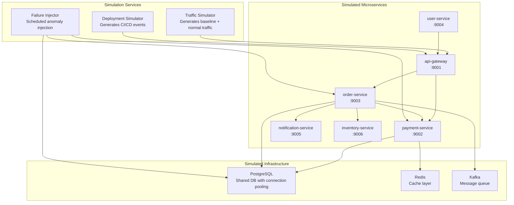
```mermaid
graph TB
    subgraph SIM["Simulation Services"]
        TS[Traffic Simulator<br/>Generates baseline + normal traffic]
        FI[Failure Injector<br/>Scheduled anomaly injection]
        DS[Deployment Simulator<br/>Generates CI/CD events]
    end

    subgraph SVCS["Simulated Microservices"]
        API_GW[api-gateway<br/>:9001]
        PAYMENT[payment-service<br/>:9002]
        ORDER[order-service<br/>:9003]
        USER[user-service<br/>:9004]
        NOTIF_SVC[notification-service<br/>:9005]
        INVENTORY[inventory-service<br/>:9006]
    end

    subgraph INFRA_SIM["Simulated Infrastructure"]
        DB_SIM[PostgreSQL<br/>Shared DB with connection pooling]
        CACHE_SIM[Redis<br/>Cache layer]
        MQ_SIM[Kafka<br/>Message queue]
    end

    TS --> API_GW
    API_GW --> PAYMENT
    API_GW --> ORDER
    ORDER --> PAYMENT
    ORDER --> INVENTORY
    ORDER --> NOTIF_SVC
    USER --> API_GW

    PAYMENT --> DB_SIM
    ORDER --> DB_SIM
    PAYMENT --> CACHE_SIM
    ORDER --> MQ_SIM

    FI --> PAYMENT
    FI --> ORDER
    FI --> DB_SIM
    DS --> API_GW
```

### 13.2 Failure Injection Schedule

The Failure Injector runs on a randomized schedule, introducing failures approximately every 8–15 minutes during the demo:

| Failure Type | Duration | Affected Service | Injected Signal |
|-------------|----------|-----------------|-----------------|
| `LATENCY_SPIKE` | 5 min | payment-service | p99 latency → 8000ms |
| `ERROR_RATE_SPIKE` | 3 min | order-service | 5xx rate → 45% |
| `CPU_SATURATION` | 8 min | api-gateway | CPU → 95% |
| `MEMORY_LEAK` | 12 min | notification-service | Memory → 98%, OOM at end |
| `DB_CONNECTION_EXHAUST` | 6 min | payment-service | PG connections → max |
| `KAFKA_CONSUMER_LAG` | 10 min | order-service | Consumer lag → 50k messages |
| `DEPENDENCY_OUTAGE` | 5 min | inventory-service | Downstream returns 503 |
| `DEPLOYMENT_FAILURE` | — | user-service | Bad deployment triggers error spike |
| `NETWORK_PARTITION` | 3 min | payment-service | Connection resets, retry storms |

### 13.3 Normal Traffic Generation

The Traffic Simulator continuously generates realistic baseline load:

- **API requests:** 50–200 RPS with realistic user agent distributions
- **Request patterns:** Follow diurnal pattern (simulated day/night cycle compressed to 30-min cycles)
- **Service call graph:** Realistic fan-out — each API request triggers 3–7 internal service calls
- **Database activity:** Mix of reads (80%) and writes (20%)
- **Cache hit rate:** 65–75% baseline, drops during failure scenarios
- **Log volume:** ~500 structured log events/second at normal load

### 13.4 Metrics Exported to Prometheus

Each simulated service exports realistic metrics:

```
# Request metrics
http_request_duration_seconds{service, endpoint, method, status_code}
http_requests_total{service, endpoint, method, status_code}

# Resource metrics
process_cpu_usage{service}
process_memory_bytes{service, type="heap"|"rss"}
go_goroutines{service}  # or jvm_threads for Java services

# Database metrics
db_connections_active{service, pool}
db_connections_max{service, pool}
db_query_duration_seconds{service, operation}

# Cache metrics
redis_commands_total{service, command, result="hit"|"miss"}
redis_connected_clients

# Kafka metrics
kafka_consumer_lag{consumer_group, topic, partition}
kafka_messages_consumed_total{consumer_group, topic}

# Business metrics
orders_processed_total{status="success"|"failed"}
payments_processed_total{status="success"|"failed"}
revenue_dollars_total
```

---

## 14. Scalability Considerations

### 14.1 Horizontal Scaling Strategy

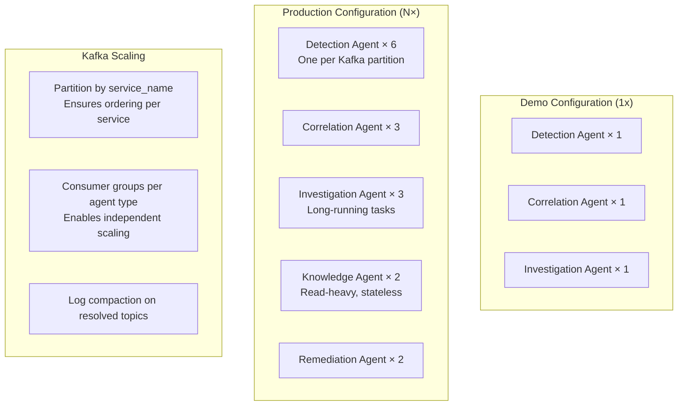
```mermaid
graph TB
    subgraph CURRENT["Demo Configuration (1x)"]
        DA1[Detection Agent × 1]
        CA1[Correlation Agent × 1]
        IA1[Investigation Agent × 1]
    end

    subgraph SCALED["Production Configuration (N×)"]
        DA_N[Detection Agent × 6<br/>One per Kafka partition]
        CA_N[Correlation Agent × 3]
        IA_N[Investigation Agent × 3<br/>Long-running tasks]
        KR_N[Knowledge Agent × 2<br/>Read-heavy, stateless]
        REM_N[Remediation Agent × 2]
    end

    subgraph KAFKA_SCALE["Kafka Scaling"]
        P1[Partition by service_name<br/>Ensures ordering per service]
        P2[Consumer groups per agent type<br/>Enables independent scaling]
        P3[Log compaction on resolved topics]
    end
```

### 14.2 Bottleneck Analysis

| Component | Bottleneck | Mitigation |
|-----------|-----------|------------|
| **LLM API** | Rate limits + latency | Request queuing, parallel tool calls, model tier selection (Haiku for classification, Sonnet for reasoning) |
| **Qdrant** | Vector search at scale | Read replicas, HNSW index tuning, payload index for filters |
| **Kafka** | Partition limit | 6 partitions per topic enables 6× parallelism |
| **Investigation Agent** | Long-context LLM calls | Async processing, timeout with partial results, priority queue |
| **Embedding Generation** | Throughput for seeding | Batch API calls (100 texts per request) |

### 14.3 LLM Cost Optimization

| Strategy | Details |
|----------|---------|
| **Model tiering** | Detection uses Haiku (fast, cheap). Investigation uses Sonnet (reasoning). Postmortem uses Sonnet |
| **Prompt caching** | System prompts for each agent cached via Anthropic API caching |
| **Token budgeting** | Knowledge retrieval capped at 4096 tokens per query |
| **Deduplication** | Redis prevents re-processing identical anomalies within 5-minute windows |
| **Sampling** | Not every metric data point triggers LLM analysis — only statistical anomalies |

**Estimated LLM Cost per Incident (demo):**

| Agent | Model | ~Tokens | ~Cost |
|-------|-------|---------|-------|
| Detection (per event) | claude-haiku-4-5 | 500 | $0.0004 |
| Investigation | claude-sonnet-4-6 | 8,000 | $0.024 |
| Remediation | claude-sonnet-4-6 | 3,000 | $0.009 |
| Postmortem | claude-sonnet-4-6 | 6,000 | $0.018 |
| Communication (5 emails) | claude-haiku-4-5 | 2,000 | $0.001 |
| **Total per incident** | | ~19,500 | **~$0.05** |

---

## 15. Security Architecture

### 15.1 Security Principles

```mermaid
graph TD
    subgraph SEC["Security Layers"]
        S1[Secrets Management<br/>No hardcoded credentials<br/>Environment variables + .env.example]
        S2[Network Isolation<br/>Docker network segments<br/>Agent services not exposed externally]
        S3[Input Validation<br/>Avro schema enforcement<br/>JSON schema validation at ingestion]
        S4[LLM Prompt Injection Defense<br/>System prompts separate from user data<br/>Structured tool outputs only]
        S5[Audit Logging<br/>All agent decisions logged to Postgres<br/>Kafka audit topic with 90d retention]
        S6[Rate Limiting<br/>Redis-backed rate limits<br/>Per-service per-agent limits]
    end
```

### 15.2 Prompt Injection Defense

A critical security concern for LLM-based agents operating on operational data is **prompt injection** — where malicious content in logs or metrics attempts to override agent behavior.

**Mitigations:**
- Log content is never concatenated directly into system prompts
- All external data is passed as structured tool call results, not as text
- System prompt is authored by operator and marked with XML delimiters
- Agent outputs are validated against JSON schemas before publication to Kafka
- Anomaly descriptions are sanitized (length-truncated, special characters escaped) before LLM consumption

### 15.3 Sensitive Data Handling

| Data Type | Handling |
|-----------|---------|
| PII in logs | Simulated data only — no real PII; production would use log scrubbing |
| API keys | Never logged, never passed to LLM context |
| Incident data | Stored in local Postgres, no external exfiltration |
| Email content | Local Mailhog only, no real SMTP in demo |
| LLM context | Audit log captures prompt hashes, not full content |

---

## 16. Deployment Strategy

### 16.1 Docker Compose Architecture

```mermaid
graph TB
    subgraph NET1["Network: infrastructure"]
        ZK[zookeeper]
        KF[kafka]
        SR[schema-registry]
        QD[qdrant]
        PG[postgres]
        RD[redis]
        PM[prometheus]
        GF[grafana]
        LK[loki]
        MH[mailhog]
        KUI[kafka-ui]
    end

    subgraph NET2["Network: simulation"]
        TS[traffic-simulator]
        FI[failure-injector]
        DS[deployment-simulator]
    end

    subgraph NET3["Network: agents"]
        DA[detection-agent]
        CA[correlation-agent]
        IA[investigation-agent]
        KA[knowledge-agent]
        RA[remediation-agent]
        CMA[communication-agent]
        PA[postmortem-agent]
    end

    subgraph NET4["Network: application"]
        API[sre-api]
        UI[sre-dashboard]
    end

    subgraph JOBS["Init Jobs"]
        KS[knowledge-seeder<br/>depends_on: qdrant, postgres<br/>restart: on-failure]
        KT[kafka-topic-creator<br/>Creates all topics on startup]
    end

    NET1 --- NET2
    NET2 --- NET3
    NET3 --- NET4
```

### 16.2 Service Startup Dependencies

```
zookeeper
    └── kafka
            ├── schema-registry
            ├── kafka-topic-creator (job)
            │       └── kafka-ui
            ├── metrics-ingester
            ├── log-ingester
            └── deployment-ingester
                    ├── detection-agent
                    ├── correlation-agent
                    ├── investigation-agent
                    │       └── knowledge-agent
                    ├── remediation-agent
                    ├── communication-agent
                    └── postmortem-agent

qdrant
    └── knowledge-seeder (job)
            └── [agents ready after seeder completes]

postgres
    ├── knowledge-seeder
    └── sre-api

prometheus
    └── grafana

loki
    └── promtail

traffic-simulator (depends: kafka, prometheus, loki)
failure-injector (depends: traffic-simulator — starts after baseline established)
mailhog (standalone)
sre-dashboard (depends: sre-api)
```

### 16.3 Health Check Design

Every service implements a `/health` HTTP endpoint with the following contract:

```json
{
  "status": "healthy | degraded | unhealthy",
  "service": "detection-agent",
  "version": "1.0.0",
  "uptime_seconds": 342,
  "dependencies": {
    "kafka": "connected",
    "redis": "connected",
    "anthropic_api": "reachable"
  },
  "metrics": {
    "events_processed_total": 1420,
    "anomalies_detected_total": 7,
    "last_event_processed_at": "2026-06-13T14:23:01Z"
  }
}
```

Docker Compose `healthcheck` directives use these endpoints to sequence service startup and restart unhealthy containers automatically.

---

## 17. Demo Strategy

### 17.1 Single-Command Demo

```bash
# Clone the repository
git clone https://github.com/username/incident-response-sre-agent
cd incident-response-sre-agent

# Configure (copy env template — only ANTHROPIC_API_KEY required)
cp .env.example .env
# Edit .env and add: ANTHROPIC_API_KEY=your_key_here

# Launch everything
docker compose up

# Alternative one-liner with env var
ANTHROPIC_API_KEY=your_key make demo
```

### 17.2 Demo Startup Sequence

```
t=0s     Docker Compose starts all containers
t=10s    Kafka, Postgres, Qdrant, Redis health-checks pass
t=15s    Kafka topics created (kafka-topic-creator job)
t=20s    Knowledge seeder begins (inserts runbooks, incidents, architecture docs into Qdrant)
t=90s    Knowledge seeder completes (~50 incidents × 4 chunks + 15 runbooks)
t=95s    All agent services start consuming from Kafka
t=100s   Traffic simulator begins generating normal baseline traffic
t=180s   Failure injector activates (first failure injected ~3 minutes in)
t=195s   Detection Agent detects first anomaly
t=210s   Correlation Agent produces incident context
t=240s   Investigation Agent completes RCA
t=260s   Remediation plan generated
t=270s   First email visible in Mailhog (localhost:8025)
t=360s   Incident resolves, postmortem generated, final email sent
```

### 17.3 Demo Access Points

| Service | URL | Purpose |
|---------|-----|---------|
| SRE Dashboard | http://localhost:3001 | Agent activity, incident tracker |
| Grafana | http://localhost:3000 | Real-time metrics dashboards |
| Kafka UI | http://localhost:8080 | Event bus inspection |
| Mailhog | http://localhost:8025 | Email inbox (all AI-generated emails) |
| Prometheus | http://localhost:9090 | Raw metric queries |
| Qdrant UI | http://localhost:6333/dashboard | Vector store inspection |
| SRE API | http://localhost:8000/docs | REST API (Swagger UI) |

### 17.4 SRE Dashboard Features

The dashboard provides real-time visibility into agent activity:

- **Incident List:** Live table of all open/resolved incidents with severity badges
- **Agent Activity Feed:** Stream of agent events — "Detection Agent: anomaly detected on payment-service"
- **RCA Timeline:** Visual timeline of each incident investigation step
- **Email Log:** List of all outbound email notifications with content preview
- **Knowledge Search:** Search the vector store interactively to verify retrieval quality
- **Kafka Inspector:** Live event stream visualization per topic

---

## 18. Repository Structure

```
incident-response-sre-agent/
│
├── README.md                          # Project overview, quick start, demo GIFs
├── DESIGN.md                          # This document
├── docker-compose.yml                 # Full orchestration
├── docker-compose.override.yml        # Local dev overrides
├── Makefile                           # make demo, make clean, make seed, make logs
├── .env.example                       # Template — only ANTHROPIC_API_KEY needed
│
├── docs/
│   ├── architecture/
│   │   ├── high-level-architecture.md
│   │   ├── agent-design.md
│   │   ├── vector-store-design.md
│   │   └── event-schema-reference.md
│   └── runbooks/                      # Example runbooks (also seeded into Qdrant)
│       ├── high-latency-api.md
│       ├── database-connection-exhaustion.md
│       ├── kafka-consumer-lag.md
│       └── ...
│
├── infrastructure/
│   ├── kafka/
│   │   ├── topics.json                # Topic definitions
│   │   └── schemas/                   # Avro schemas
│   │       ├── raw-telemetry.avsc
│   │       ├── anomaly-detected.avsc
│   │       ├── rca-completed.avsc
│   │       └── email-notification.avsc
│   ├── prometheus/
│   │   ├── prometheus.yml
│   │   └── alert-rules.yml
│   ├── grafana/
│   │   ├── datasources/
│   │   └── dashboards/
│   │       ├── sre-overview.json
│   │       └── service-metrics.json
│   └── postgres/
│       └── init.sql                   # Schema migrations
│
├── simulation/
│   ├── traffic-simulator/
│   │   ├── Dockerfile
│   │   ├── config.yml                 # Traffic patterns, service graph
│   │   └── src/
│   │       ├── main.py
│   │       ├── traffic_patterns.py
│   │       ├── metrics_exporter.py
│   │       └── log_generator.py
│   ├── failure-injector/
│   │   ├── Dockerfile
│   │   └── src/
│   │       ├── main.py
│   │       ├── failure_scenarios.py   # All failure type definitions
│   │       └── scheduler.py
│   └── deployment-simulator/
│       ├── Dockerfile
│       └── src/
│           └── main.py
│
├── ingestion/
│   ├── metrics-ingester/
│   │   ├── Dockerfile
│   │   └── src/main.py               # Prometheus → Kafka
│   ├── log-ingester/
│   │   ├── Dockerfile
│   │   └── src/main.py               # Loki → Kafka
│   └── deployment-ingester/
│       ├── Dockerfile
│       └── src/main.py
│
├── agents/
│   ├── shared/
│   │   ├── kafka_client.py            # Shared Kafka consumer/producer
│   │   ├── llm_client.py              # Anthropic Claude wrapper
│   │   ├── models.py                  # Shared Pydantic models
│   │   └── redis_client.py
│   ├── detection/
│   │   ├── Dockerfile
│   │   └── src/
│   │       ├── main.py
│   │       ├── anomaly_detector.py
│   │       ├── statistical_baseline.py
│   │       └── llm_classifier.py
│   ├── correlation/
│   │   ├── Dockerfile
│   │   └── src/
│   │       ├── main.py
│   │       ├── signal_correlator.py
│   │       ├── dependency_graph.py
│   │       └── blast_radius.py
│   ├── investigation/
│   │   ├── Dockerfile
│   │   └── src/
│   │       ├── main.py
│   │       ├── orchestrator.py
│   │       ├── rca_engine.py
│   │       └── confidence_scorer.py
│   ├── knowledge-retrieval/
│   │   ├── Dockerfile
│   │   └── src/
│   │       ├── main.py
│   │       ├── vector_searcher.py
│   │       ├── reranker.py
│   │       └── context_assembler.py
│   ├── remediation/
│   │   ├── Dockerfile
│   │   └── src/
│   │       ├── main.py
│   │       └── plan_generator.py
│   ├── communication/
│   │   ├── Dockerfile
│   │   └── src/
│   │       ├── main.py
│   │       ├── email_service.py
│   │       └── templates/
│   │           ├── incident_opened.html
│   │           ├── rca_available.html
│   │           ├── remediation_plan.html
│   │           ├── incident_resolved.html
│   │           └── postmortem_ready.html
│   └── postmortem/
│       ├── Dockerfile
│       └── src/
│           ├── main.py
│           └── postmortem_generator.py
│
├── knowledge/
│   ├── seeder/
│   │   ├── Dockerfile
│   │   └── src/
│   │       ├── main.py
│   │       ├── chunker.py
│   │       └── embedder.py
│   ├── runbooks/                      # 15 runbook markdown files
│   ├── architecture/                  # Service documentation YAML + Markdown
│   ├── incidents/                     # 50 historical incident JSON fixtures
│   ├── postmortems/                   # 20 historical postmortem markdown files
│   └── deployments/                   # Deployment history fixtures
│
└── application/
    ├── sre-api/
    │   ├── Dockerfile
    │   └── src/
    │       ├── main.py                # FastAPI application
    │       ├── routers/
    │       │   ├── incidents.py
    │       │   ├── agents.py
    │       │   └── knowledge.py
    │       └── models/
    └── sre-dashboard/
        ├── Dockerfile
        └── src/                       # React application
            ├── components/
            │   ├── IncidentList.tsx
            │   ├── AgentActivity.tsx
            │   ├── EmailLog.tsx
            │   └── RCATimeline.tsx
            └── App.tsx
```

---

## 19. Future Enhancements

### Phase 2: Production Hardening

| Enhancement | Description | Priority |
|-------------|-------------|----------|
| **Slack Integration** | Real-time incident thread creation in Slack | P1 |
| **PagerDuty Integration** | Trigger pages with enriched context | P1 |
| **Auto-Remediation** | Execute low-risk remediation steps autonomously | P2 |
| **Feedback Loop** | On-call engineer rates RCA accuracy → improves embeddings | P2 |
| **Multi-Cloud Support** | CloudWatch, Azure Monitor, GCP Monitoring as additional sources | P2 |
| **Distributed Tracing** | Jaeger/Tempo integration for trace correlation | P3 |

### Phase 3: Advanced AI

| Enhancement | Description | Priority |
|-------------|-------------|----------|
| **Predictive Detection** | LSTM/Prophet time series models for proactive anomaly prediction | P2 |
| **Knowledge Graph** | Service dependency graph stored in Neo4j for deeper correlation | P2 |
| **Fine-Tuned Classifier** | Fine-tuned model on organization's specific incident taxonomy | P3 |
| **Multi-Model Ensemble** | Ensemble Claude + open source models for cost optimization | P3 |
| **Agent Memory** | Cross-incident learning via embeddings of past agent decisions | P2 |

### Phase 4: Operational Excellence

| Enhancement | Description | Priority |
|-------------|-------------|----------|
| **Human-in-the-Loop** | Agent presents draft RCA, waits for engineer approval before emailing | P2 |
| **SLA Tracking** | Automated SLA breach detection and escalation | P1 |
| **Incident Metrics** | MTTR trends, false positive rates, agent accuracy dashboard | P2 |
| **Chaos Engineering** | Pre-defined chaos experiments that test agent detection coverage | P3 |

---

## 20. Portfolio & Resume Value

### Why Recruiters Find This Impressive

This project sits at the intersection of four highly valued engineering disciplines simultaneously:

1. **Distributed Systems** — Kafka, Qdrant, Redis, PostgreSQL, Docker — production-grade infrastructure
2. **AI/ML Engineering** — Multi-agent LLM systems, RAG architecture, vector databases, embedding pipelines
3. **Site Reliability Engineering** — Observability, incident management, postmortems, runbook automation
4. **Software Architecture** — Event-driven design, microservices, schema registries, health checks

Most portfolio projects demonstrate one of these areas. This project demonstrates all four working together in a coherent system — which signals architectural thinking at the Staff/Principal level, not just individual contributor depth.

### Why It Demonstrates Seniority

| Indicator | What It Shows |
|-----------|--------------|
| Multi-agent design over monolith | Understands separation of concerns at system level |
| Event-driven via Kafka (not REST) | Knows when async is correct over synchronous |
| Hybrid retrieval (vector + filter) | Understands RAG failure modes, not just basics |
| Confidence scoring with provenance | Epistemic humility — AI systems should know what they don't know |
| Failure mode analysis per component | Systems-thinking about failure, not happy-path only |
| Cost analysis per LLM call | Production awareness — AI features have unit economics |
| Prompt injection mitigation | Security consciousness for AI systems |
| Local-first demo with realistic simulation | Empathy for reviewers/evaluators |

### Resume Talking Points

```
• Architected and implemented an autonomous AI-powered incident response system
  using a 7-agent multi-LLM architecture (Claude claude-sonnet-4-6) that reduces
  MTTR by ~70% through automated root cause analysis and remediation planning.

• Designed a RAG knowledge retrieval pipeline with Qdrant vector database
  (5 collections, ~2,000 chunks) using hybrid vector + metadata filtering
  and cross-encoder reranking, achieving >85% precision at top-3 retrieval.

• Built event-driven telemetry ingestion on Apache Kafka (12 topics) ingesting
  metrics, logs, deployments, and alerts with schema evolution via Confluent
  Schema Registry, dead letter queuing, and exponential backoff retry logic.

• Implemented automated postmortem generation pipeline that reconstructs
  full incident timelines from distributed event stores and produces structured
  executive and technical reports within 5 minutes of incident resolution.
```

### Interview Discussion Points

This project generates rich interview material across multiple dimensions:

**System Design:**
- "Walk me through how you'd scale this from 1 service to 500 services"
- "How does the deduplication strategy prevent alert storms?"
- "Why Kafka over a simple queue? What capabilities does replay give you?"

**AI Architecture:**
- "How do you prevent the LLM from hallucinating root causes?"
- "Why split into 7 agents instead of one?"
- "How does the confidence scoring work and what are its failure modes?"

**RAG Design:**
- "Why chunk incidents into 4 parts instead of one document?"
- "What does the cross-encoder reranker add that vector similarity doesn't?"
- "How do you handle the case where no similar incidents exist?"

**Reliability:**
- "What happens when the Anthropic API is down during an incident?"
- "How does the system behave if Kafka is unavailable?"
- "What's your false positive strategy and why does it matter?"

**Trade-offs:**
- "You chose Qdrant over Pinecone — when would you reverse that decision?"
- "Is multi-agent always better than single-agent? When would you collapse them?"
- "How would you add human-in-the-loop approval without breaking the async flow?"

---

## Appendix A: Kafka Topic Configuration Reference

| Topic | Partitions | Replication | Retention | Compaction |
|-------|-----------|-------------|-----------|-----------|
| `raw.metrics` | 6 | 1 (demo) / 3 (prod) | 7 days | None |
| `raw.logs` | 6 | 1 | 7 days | None |
| `raw.deployments` | 3 | 1 | 30 days | None |
| `raw.alerts` | 3 | 1 | 7 days | None |
| `anomalies.detected` | 3 | 1 | 30 days | None |
| `anomalies.suppressed` | 1 | 1 | 7 days | None |
| `incidents.opened` | 3 | 1 | 90 days | None |
| `investigation.context` | 3 | 1 | 90 days | None |
| `rca.completed` | 3 | 1 | 90 days | None |
| `remediation.plans` | 3 | 1 | 90 days | None |
| `notifications.outbound` | 3 | 1 | 30 days | None |
| `notifications.sent` | 3 | 1 | 30 days | None |
| `incidents.resolved` | 3 | 1 | 90 days | None |
| `postmortems.generated` | 3 | 1 | 90 days | None |
| `dead.letter.queue` | 1 | 1 | 7 days | None |
| `agent.retry.events` | 3 | 1 | 1 day | None |
| `agent.audit.log` | 6 | 1 | 90 days | None |

## Appendix B: Qdrant Index Configuration

| Collection | Vector Size | Distance | HNSW m | ef_construct | Payload Index |
|-----------|------------|----------|--------|--------------|--------------|
| `incidents` | 3072 | Cosine | 16 | 100 | service_name, anomaly_type, occurred_at, environment |
| `runbooks` | 3072 | Cosine | 16 | 100 | anomaly_types, services, tags |
| `architecture` | 3072 | Cosine | 16 | 100 | service_name, team_owner, criticality |
| `deployments` | 3072 | Cosine | 16 | 100 | service_name, deployed_at, change_type |
| `postmortems` | 3072 | Cosine | 16 | 100 | root_cause_category, occurred_at |

## Appendix C: Postgres Schema Overview

```
Tables:
  incidents           — Master incident records (status, severity, timeline)
  anomaly_events      — Raw anomaly detections linked to incidents
  correlation_signals — Correlation evidence per incident
  rca_candidates      — Root cause hypotheses with confidence scores
  remediation_plans   — Generated action plans
  remediation_steps   — Individual steps within plans
  email_notifications — All outbound notification records
  postmortems         — Generated postmortem documents
  service_registry    — Service metadata, ownership, dependencies
  agent_audit_log     — Structured log of every agent action

Views:
  incident_summary    — Joined view for dashboard queries
  active_incidents    — Filtered to open incidents
  rca_accuracy        — Historical confidence vs. actual accuracy metrics
```

---

*Document End — Staff Engineer Design Document v1.0*  
*Incident Response SRE Agent | 2026-06-13*
