# Incident Response SRE Agent

> **Autonomous AI system that reduces Mean Time to Resolution from hours to minutes.**
>
> A production-grade, multi-agent architecture that monitors six microservices in real time, detects anomalies using statistical baselines, investigates root causes via Claude's tool-use API against a RAG knowledge base, generates runbook-grounded remediation plans, and writes blameless postmortems — end-to-end, with zero human intervention required.

---

## Quick Start

### Prerequisites

| Requirement | Version | Notes |
|---|---|---|
| Docker | 24+ | [docs.docker.com/get-docker](https://docs.docker.com/get-docker/) |
| Docker Compose | v2 (Compose V2) | Bundled with Docker Desktop; verify with `docker compose version` |
| Anthropic API Key | — | [console.anthropic.com](https://console.anthropic.com) — any tier works |
| Available RAM | 8 GB minimum | 16 GB recommended (Kafka + Qdrant + 6 agents + Postgres + Redis) |
| Available Disk | 5 GB free | Docker images + Qdrant persistent volume |
| OS | macOS / Linux / WSL2 | Windows requires WSL2 with Docker Desktop |

> **No Python, no Node, no other tooling required.** Everything runs inside Docker containers.

### One-command demo

```bash
# 1. Clone and configure
git clone https://github.com/amudhan023/incident-response-sre-agent.git
cd incident-response-sre-agent
cp .env.example .env
# Open .env and set: ANTHROPIC_API_KEY=sk-ant-...

# 2. Start everything (builds images on first run, ~3–5 min)
make demo

# 3. Wait ~3 minutes for full initialisation, then open:
open http://localhost:8000          # SRE Dashboard — live incident feed
open http://localhost:8025          # Mailhog — watch 5 emails arrive per incident
open http://localhost:3000          # Grafana (admin / admin) — live service metrics
open http://localhost:8080          # Kafka UI — inspect topic flow message by message
open http://localhost:6333/dashboard  # Qdrant — browse vector collections

# 4. Follow agent logs in real time
make logs

# First failure injection occurs ~60 seconds after the simulator starts.
# Check Mailhog — five structured HTML emails arrive automatically per incident.
```

### What Happens Automatically

```
t=0s    16 Docker services start with enforced health-check ordering
t=30s   Knowledge seeder: embeds 20 incidents + 7 runbooks + 6 service docs → Qdrant
t=60s   Event simulator: 6 services emit metrics + logs to Kafka every 10 seconds
t=120s  First failure injected (random from 7 scenarios, gradual ramp)
t=135s  Detection Agent: z-score breach → Claude Haiku → anomalies.detected
        Email 1: 🚨 Incident Alert with deviation sigma and anomaly score
t=145s  Correlation Agent: blast radius + deployment check → incidents.opened
t=180s  Investigation Agent: 3-4 Claude tool calls against Qdrant → rca.completed
        Email 2: 🔍 Root Cause Analysis with confidence score and evidence
t=190s  Remediation Agent: runbook retrieval + action plan → remediation.plans
        Email 3: 🛠️ Remediation Plan with prioritised steps and rollback procedures
t=500s  Metrics normalise → incidents.resolved (MTTR calculated)
        Email 4: ✅ Incident Resolved with MTTR in minutes
t=510s  Postmortem Agent: timeline from DB → Claude Sonnet → postmortems.generated
        Email 5: 📋 Postmortem with blameless analysis and action items
```

### Make Targets

| Command | Description |
|---|---|
| `make demo` | Build all images and start full stack |
| `make start` | Start without rebuilding |
| `make stop` | Stop all services |
| `make clean` | Stop + remove all volumes (full reset) |
| `make logs` | Follow all 6 agent logs |
| `make logs-sim` | Follow event simulator only |
| `make logs-api` | Follow SRE API only |
| `make status` | Show Docker Compose health (`docker compose ps`) |
| `make build` | Pre-build all images |
| `make seed` | Re-run knowledge seeder only |
| `make restart-agents` | Restart all 6 agents |

---

```
┌─────────────────────────────────────────────────────────────────────────────┐
│                         SYSTEM AT A GLANCE                                  │
├──────────────────┬──────────────────┬──────────────────┬────────────────────┤
│  Multi-Agent AI  │  Event-Driven    │  RAG + Vector    │  Autonomous        │
│  6 Agents        │  Kafka 9 Topics  │  Qdrant 3 Colls  │  Detection to PM   │
├──────────────────┼──────────────────┼──────────────────┼────────────────────┤
│  Claude Tool Use │  Stat Baselines  │  MiniLM Embeds   │  HTML Emails       │
│  Agentic Loop    │  Redis Z-score   │  Cosine Search   │  per Lifecycle     │
└──────────────────┴──────────────────┴──────────────────┴────────────────────┘
```

| Dimension | Detail |
|---|---|
| **Agents** | 6 specialized agents: Detection → Correlation → Investigation → Remediation → Communication → Postmortem |
| **LLMs** | Claude Sonnet 4.6 (reasoning, tool use, postmortems) + Claude Haiku 4.5 (fast anomaly classification) |
| **Vector Store** | Qdrant v1.8 · 3 collections: `incidents`, `runbooks`, `architecture` |
| **Embeddings** | `all-MiniLM-L6-v2` (384-dim, cosine) via SentenceTransformers — runs locally, no API key |
| **Message Bus** | Apache Kafka (Confluent 7.5.3) · 9-topic pipeline with consumer group isolation |
| **State Store** | PostgreSQL 15 · full incident audit trail + JSONB flexible schema |
| **Metric Cache** | Redis 7 · 50-sample rolling baseline per service+metric, 5-min dedup TTL |
| **Observability** | Prometheus + Grafana pre-wired dashboard provisioned at startup |
| **Notifications** | Jinja2 HTML emails at 5 lifecycle stages via SMTP (Mailhog in demo) |
| **Simulation** | 7 realistic failure scenarios injected on a 5–10 minute randomised schedule |

---

## Table of Contents

1. [Quick Start](#quick-start)
2. [Problem Statement](#2-problem-statement)
3. [Solution Overview](#3-solution-overview)
4. [End-to-End Architecture](#4-end-to-end-architecture)
5. [Kafka Topic Pipeline](#5-kafka-topic-pipeline)
6. [Agent Pipeline Deep-Dive](#6-agent-pipeline-deep-dive)
7. [Investigation Agent — Agentic Tool-Use Loop](#7-investigation-agent--agentic-tool-use-loop)
8. [RAG Architecture](#8-rag-architecture)
9. [Vector Store Design](#9-vector-store-design)
10. [Incident Lifecycle & State Machine](#10-incident-lifecycle--state-machine)
11. [Full Execution Walkthrough](#11-full-execution-walkthrough)
12. [Data Flow Diagram](#12-data-flow-diagram)
13. [Error Handling & Retry Logic](#13-error-handling--retry-logic)
14. [Observability Architecture](#14-observability-architecture)
15. [Scalability Design](#15-scalability-design)
16. [Security Architecture](#16-security-architecture)
17. [Deployment Architecture](#17-deployment-architecture)
18. [Project Structure](#18-project-structure)
19. [Service Catalogue](#19-service-catalogue)
20. [Failure Scenarios](#20-failure-scenarios)
21. [Technical Highlights](#21-technical-highlights)
22. [Roadmap](#22-roadmap)

---

## 1. Problem Statement

### The On-Call Engineer's Nightmare

A production incident fires at 3 AM. The on-call engineer is paged. They must:

1. Determine if the alert is real (noise ratio in most orgs exceeds 80%)
2. Identify which service and metric triggered it
3. Check whether a recent deployment caused it
4. Find the correct runbook in Confluence
5. Search for similar past incidents
6. Estimate blast radius — which downstream services are affected?
7. Build a remediation plan and execute it under pressure
8. Write a postmortem from memory hours later

**This process takes 45–120 minutes on average.** During that time, customers experience degradation, revenue is lost, and the on-call engineer operates under cognitive overload with incomplete information.

### Why Traditional Monitoring Fails

| Traditional Approach | Failure Mode |
|---|---|
| Static threshold alerts | Wrong threshold = alert storm or silent failure; thresholds don't adapt to traffic patterns |
| Manual runbook lookup | Time-consuming under pressure; runbooks go stale; hard to find the right one mid-incident |
| Manual log correlation | Humans can't hold 6 service timelines in working memory simultaneously |
| Post-incident reports | Written hours later from memory; critical timeline details are lost |
| Static dependency maps | Don't capture runtime blast radius or cascade propagation paths |

### Why AI Agents Change This

- **Statistical baselines replace static thresholds** — each service+metric gets its own rolling window; z-scores adapt automatically
- **Agentic tool use gives Claude full context** — not keyword search, but semantic retrieval of the most relevant past incidents and runbooks
- **Automated correlation checks three signals simultaneously** — deployment timing, cascade failures, upstream degradation
- **The entire pipeline runs in under 3 minutes** — detection → RCA → remediation plan → email arrives before the engineer reaches their desk

---

## 2. Solution Overview

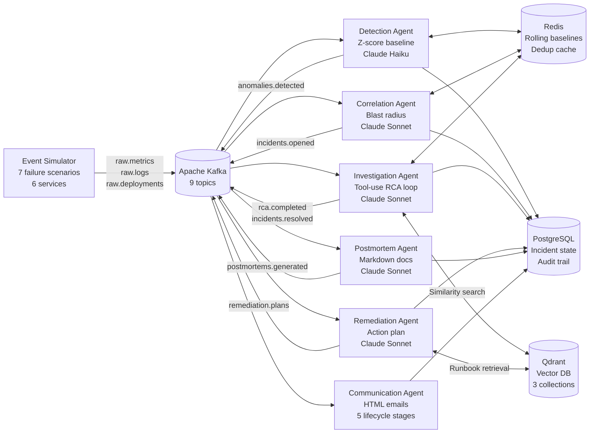

---

## 3. End-to-End Architecture

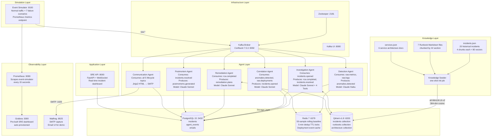

---

## 4. Kafka Topic Pipeline

```
┌──────────────────────────────────────────────────────────────────────────┐
│                        KAFKA TOPIC PIPELINE                              │
│                                                                          │
│  PRODUCER               TOPIC                    CONSUMER(S)            │
│  ────────────────────────────────────────────────────────────────────    │
│  Event Simulator  ──►  raw.metrics         ──►  Detection Agent         │
│  Event Simulator  ──►  raw.logs            ──►  Detection Agent         │
│  Event Simulator  ──►  raw.deployments     ──►  Correlation Agent       │
│                                                                          │
│  Detection Agent  ──►  anomalies.detected  ──►  Correlation Agent       │
│                                                  Communication Agent    │
│                                                                          │
│  Correlation Agt  ──►  incidents.opened    ──►  Investigation Agent     │
│                                                                          │
│  Investigation    ──►  rca.completed       ──►  Remediation Agent       │
│                                                  Communication Agent    │
│  Investigation    ──►  incidents.resolved  ──►  Postmortem Agent        │
│                                                  Communication Agent    │
│                                                                          │
│  Remediation Agt  ──►  remediation.plans   ──►  Communication Agent     │
│                                                                          │
│  Postmortem Agt   ──►  postmortems.        ──►  Communication Agent     │
│                         generated                                        │
└──────────────────────────────────────────────────────────────────────────┘
```

Each agent runs in its own Kafka **consumer group**, providing independent replay, offset management, and horizontal scale:

| Topic | Produced By | Key Payload Fields | Retention |
|---|---|---|---|
| `raw.metrics` | Event Simulator | service, metric_name, metric_value | 7 days |
| `raw.logs` | Event Simulator | service, level, message, trace_id | 7 days |
| `raw.deployments` | Event Simulator | service, version, change_type, git_sha | 7 days |
| `anomalies.detected` | Detection Agent | incident_id, anomaly_type, severity, deviation_sigma, anomaly_score | 7 days |
| `incidents.opened` | Correlation Agent | incident_id, blast_radius, correlation_signals, deployment_context | 7 days |
| `rca.completed` | Investigation Agent | incident_id, root_cause_candidates[], top_confidence | 7 days |
| `remediation.plans` | Remediation Agent | incident_id, action_steps[], escalation_path, estimated_resolution_time | 7 days |
| `incidents.resolved` | Investigation Agent | incident_id, mttr_minutes, resolution_method | 7 days |
| `postmortems.generated` | Postmortem Agent | incident_id, postmortem (full Markdown), mttr_minutes | 7 days |

---

## 5. Agent Pipeline Deep-Dive

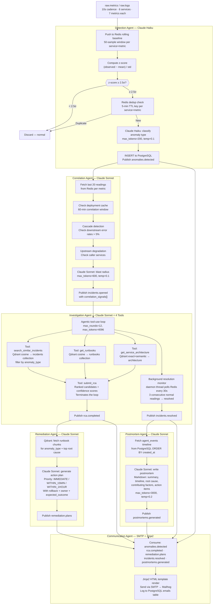

---

## 6. Investigation Agent — Agentic Tool-Use Loop

The investigation agent is the most architecturally complex component. It implements a full **agentic ReAct loop** using the Anthropic tool-use API — no LangChain, no framework, raw SDK with full control.

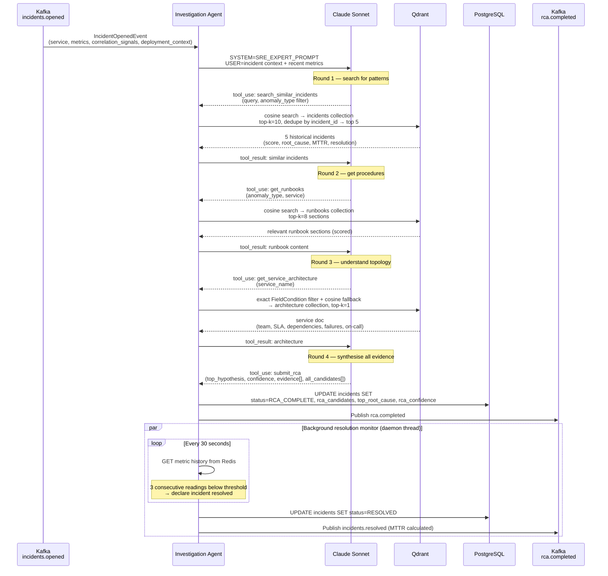

### LLM Model Strategy

| Agent | Model | Max Tokens | Rationale |
|---|---|---|---|
| Detection | `claude-haiku-4-5` | 200 | Sub-second response needed; fires on every anomaly |
| Correlation | `claude-sonnet-4-6` | 600 | Blast radius needs richer reasoning |
| Investigation | `claude-sonnet-4-6` | 4096 + tool loop | Full agentic reasoning, up to 12 rounds |
| Remediation | `claude-sonnet-4-6` | 2000 | Detailed action steps with rollback procedures |
| Postmortem | `claude-sonnet-4-6` | 3000 | Long-form document generation |

---

## 7. RAG Architecture

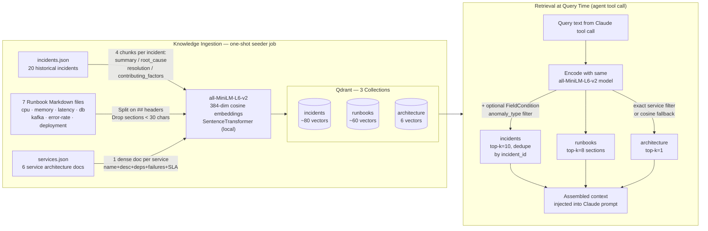

### Chunking Strategy

**Incidents** — each historical incident produces 4 semantically distinct chunks:

```
summary:    "{title}. Affected: {services}. {symptoms}"
root_cause: "Root cause: {cause}. Category: {category}."
resolution: "Resolution: {steps}. MTTR: {minutes} minutes."
factors:    "Contributing factors: {factors}. Tags: {tags}."
```

A query about *symptoms* retrieves via the summary chunk. A query about *resolution steps* retrieves via the resolution chunk. Both route to the same historical incident — maximum recall from different query angles.

**Runbooks** — split on `## ` markdown headers; sections under 30 characters dropped. Each chunk tagged with `anomaly_types[]` and `tags[]` for optional pre-filtering.

**Architecture** — one dense embedding per service, all fields concatenated (name, description, team, criticality, SLA, dependencies, common failure modes, on-call contact, runbook references).

---

## 8. Vector Store Design

```
Qdrant Collections (all cosine distance, dim=384)
──────────────────────────────────────────────────────────────────────────

  incidents
  ┌──────────────────────────────────────────────────────────────────────┐
  │ point_id │ vector[384] │ payload                                     │
  │──────────┼─────────────┼───────────────────────────────────────────  │
  │    1     │  [...384.]  │ incident_id · chunk_type: "summary"         │
  │    2     │  [...384.]  │ incident_id · chunk_type: "root_cause"      │
  │    3     │  [...384.]  │ incident_id · chunk_type: "resolution"      │
  │    4     │  [...384.]  │ incident_id · chunk_type: "factors"         │
  │   ...    │     ...     │ anomaly_type (filterable FieldCondition)    │
  │          │             │ severity · mttr_minutes · tags[]            │
  └──────────────────────────────────────────────────────────────────────┘

  runbooks (point_ids start at 10000)
  ┌──────────────────────────────────────────────────────────────────────┐
  │  10000   │  [...384.]  │ runbook_id: "high-latency-api"              │
  │          │             │ section_title: "Immediate Actions"          │
  │          │             │ text: "1. Check DB connection pool..."      │
  │          │             │ anomaly_types: ["LATENCY_SPIKE"]            │
  │          │             │ tags: ["latency", "database", "pool"]       │
  └──────────────────────────────────────────────────────────────────────┘

  architecture (point_ids start at 20000)
  ┌──────────────────────────────────────────────────────────────────────┐
  │  20000   │  [...384.]  │ service_name: "payment-service"             │
  │          │             │ team · criticality · language · sla{}       │
  │          │             │ dependencies_upstream[]                     │
  │          │             │ dependencies_downstream[]                   │
  │          │             │ common_failure_modes[]                      │
  │          │             │ on_call · runbooks[]                        │
  └──────────────────────────────────────────────────────────────────────┘

  Retrieval Details
  ─ Query embedded at runtime with identical all-MiniLM-L6-v2 model
  ─ Optional FieldCondition filters on anomaly_type or service_name
  ─ Results de-duplicated by incident_id (best-scored chunk wins)
  ─ Top-k text payloads injected directly into Claude's context window
```

---

## 9. Incident Lifecycle & State Machine

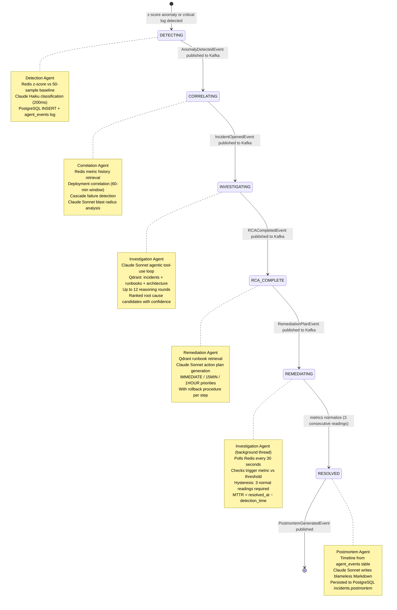

### PostgreSQL Schema

```sql
-- Full incident record with JSONB for flexible agent outputs
CREATE TABLE incidents (
    id                  UUID PRIMARY KEY,
    status              TEXT NOT NULL,           -- lifecycle stage enum
    anomaly_type        TEXT,
    severity            TEXT,
    affected_services   JSONB,
    blast_radius        JSONB,                   -- estimated_user_impact, services
    correlation_context JSONB,                   -- signals[], llm_analysis
    rca_candidates      JSONB,                   -- ranked [{hypothesis, confidence, evidence[]}]
    top_root_cause      TEXT,
    rca_confidence      FLOAT,
    remediation_plan    JSONB,                   -- action_steps[], escalation_path
    postmortem          TEXT,                    -- full Markdown document
    detection_time      BIGINT,                  -- unix ms
    resolution_time     BIGINT,
    created_at          TIMESTAMPTZ DEFAULT NOW()
);

-- Agent audit trail — source of truth for postmortem timeline
CREATE TABLE agent_events (
    id          SERIAL PRIMARY KEY,
    incident_id UUID REFERENCES incidents(id),
    agent_name  TEXT,     -- "detection-agent", "investigation-agent", etc.
    event_type  TEXT,     -- "ANOMALY_DETECTED", "RCA_COMPLETE", "INCIDENT_RESOLVED"
    payload     JSONB,
    created_at  TIMESTAMPTZ DEFAULT NOW()
);

-- Email delivery log
CREATE TABLE emails (
    id                SERIAL PRIMARY KEY,
    incident_id       UUID REFERENCES incidents(id),
    notification_type TEXT,
    recipients        TEXT[],
    subject           TEXT,
    body_html         TEXT,
    status            TEXT,    -- "SENT" | "FAILED"
    sent_at           TIMESTAMPTZ DEFAULT NOW()
);
```

---

## 10. Full Execution Walkthrough

**Scenario:** Payment service database connection pool exhaustion at 3 AM.

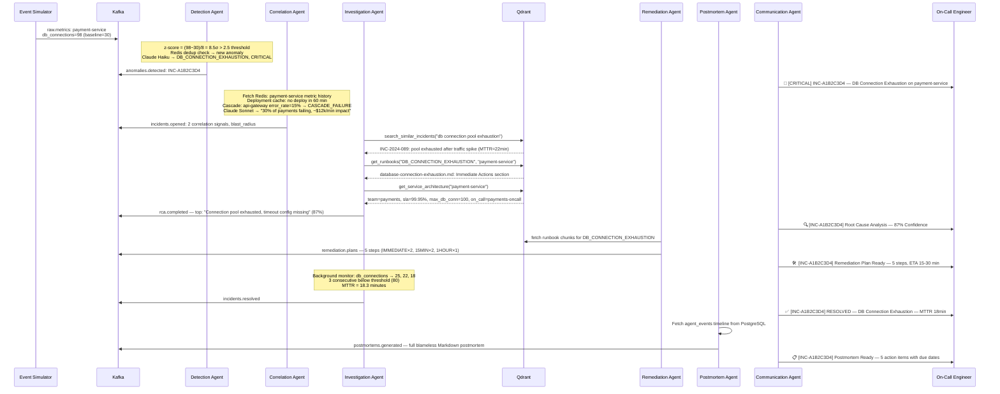

**Total autonomous pipeline time: ~3 minutes.** The on-call engineer receives 5 structured emails, reads the postmortem over morning coffee, and approves the action items — no 3 AM heroics required.

---

## 11. Data Flow Diagram

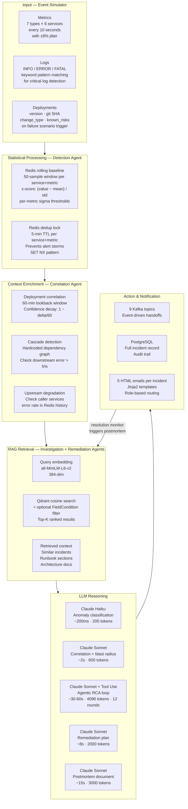

---

## 12. Error Handling & Retry Logic

```mermaid
flowchart TD
    subgraph LLM_RETRY["LLM Calls — llm_client.py"]
        A["Claude API call\nchat() or run_tool_use_agent()"] --> B{{"Success?"}}
        B -->|Yes| C["Return response text"]
        B -->|"RateLimitError"| D["Sleep 60s × attempt\nmax_retries=3"]
        D --> A
        B -->|"APIError"| E["Sleep 5s × attempt\nmax_retries=3"]
        E --> A
        B -->|"All retries exhausted"| F["Raise RuntimeError\nAgent uses deterministic fallback"]
    end

    subgraph KAFKA_LOOP["Kafka Consumer — consume_loop()"]
        G["Poll for messages"] --> H{{"Valid JSON?"}}
        H -->|No| I["Log error · skip · don't crash\nOffset committed anyway"]
        H -->|Yes| J{{"Pydantic validation?"}}
        J -->|Fail| I
        J -->|Pass| K["Call handler()"]
        K --> L{{"DB write succeeds?"}}
        L -->|No| M["Log error · continue pipeline\nKafka offset still committed"]
        L -->|Yes| N["Publish downstream event"]
        N --> G
    end

    subgraph EMAIL_RETRY["Email Delivery — communication agent"]
        O["SMTP send attempt"] --> P{{"Success?"}}
        P -->|No| Q["Retry × 3 with 2s backoff"]
        Q --> O
        P -->|"All fail"| R["Log FAILED to emails table\nDon't block pipeline"]
        P -->|Yes| S["Log SENT to emails table"]
    end

    subgraph QDRANT_RETRY["Qdrant Connection — init_qdrant()"]
        T["Connect attempt"] --> U{{"Connected?"}}
        U -->|No| V["Sleep 3s · max 20 retries"]
        V --> T
        U -->|Yes| W["All search calls wrapped\nin try/except\nError string returned to Claude\nClaude continues reasoning"]
    end
```

---

## 13. Observability Architecture

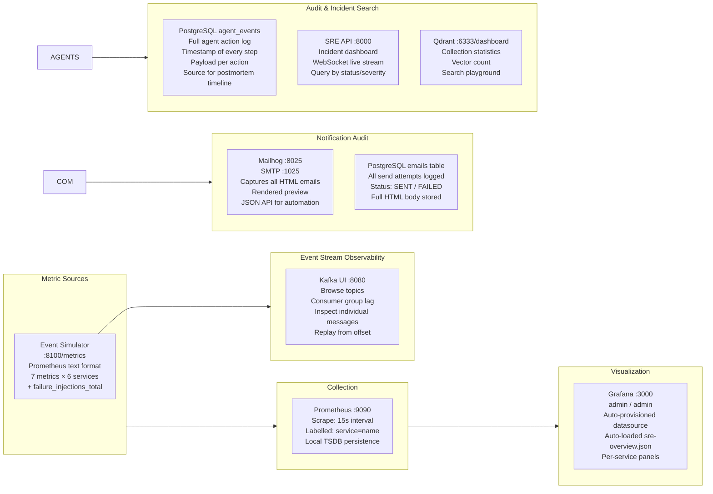

### Prometheus Metrics (per service label)

```
service_request_rate{service="payment-service"}        82.3
service_error_rate_percent{service="payment-service"}   0.48
service_latency_p99_ms{service="payment-service"}     391.2
service_cpu_percent{service="payment-service"}         22.1
service_memory_percent{service="payment-service"}      44.8
service_db_connections{service="payment-service"}      31.0
kafka_consumer_lag{service="order-service"}           103.5
failure_injections_total                                4.0
```

---

## 14. Scalability Design

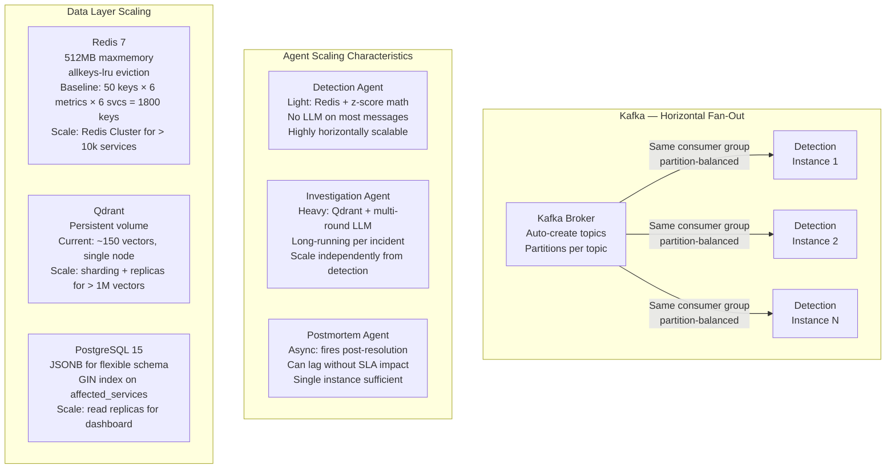

### Throughput Estimates

| Component | Throughput | Bottleneck | Scaling Lever |
|---|---|---|---|
| Event Simulator | 252 msg/min (6 svc × 7 metrics × 6/min) | None | N/A |
| Detection Agent | ~30 anomaly classifications/hr steady state | Claude Haiku rate limit | Horizontal replicas + same consumer group |
| Redis baselines | 1800 active keys (50 × 6 metrics × 6 svc) | Memory (512MB limit) | Redis Cluster for large deployments |
| Qdrant search | <50ms p99 (~150 vectors, cosine) | None at this scale | Sharding for >1M vectors |
| Claude Haiku | ~200ms/call | 100 req/min Tier 1 rate limit | Increase tier or queue |
| Claude Sonnet | 2–60s/call | 50 req/min Tier 1 rate limit | Increase tier or queue |

---

## 15. Security Architecture

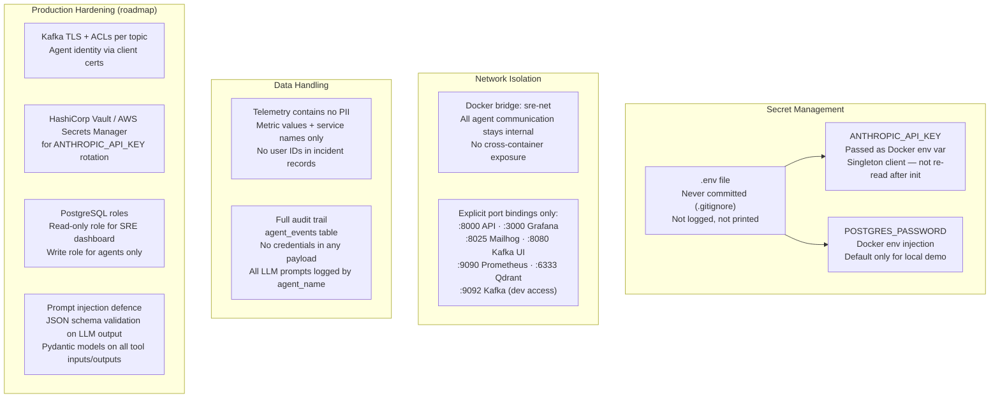

---

## 16. Deployment Architecture

### Local / Demo (Docker Compose)

```bash
make demo   # one command, builds and starts all 16 services
```

```
┌──────────────────────── Docker Bridge: sre-net ─────────────────────────────┐
│                                                                              │
│  ┌────────────┐  ┌────────────┐  ┌────────────┐  ┌────────────┐           │
│  │ zookeeper  │  │   kafka    │  │  kafka-ui  │  │   qdrant   │           │
│  │   :2181    │  │   :9092    │  │   :8080    │  │:6333/:6334 │           │
│  └────────────┘  └────────────┘  └────────────┘  └────────────┘           │
│                                                                              │
│  ┌────────────┐  ┌────────────┐  ┌────────────┐  ┌────────────┐           │
│  │  postgres  │  │   redis    │  │ prometheus │  │  grafana   │           │
│  │   :5432    │  │   :6379    │  │   :9090    │  │   :3000    │           │
│  └────────────┘  └────────────┘  └────────────┘  └────────────┘           │
│                                                                              │
│  ┌────────────┐  ┌──────────────────────────────────────────────────────┐  │
│  │  mailhog   │  │                     Agents                            │  │
│  │:8025/:1025 │  │  detection  ·  correlation  ·  investigation          │  │
│  └────────────┘  │  remediation  ·  communication  ·  postmortem         │  │
│                  └──────────────────────────────────────────────────────┘  │
│                                                                              │
│  ┌────────────┐  ┌────────────────────┐  ┌──────────────────────────────┐  │
│  │  sre-api   │  │  event-simulator   │  │   knowledge-seeder (init)    │  │
│  │   :8000    │  │   :8100 /metrics   │  │   exits after seeding Qdrant │  │
│  └────────────┘  └────────────────────┘  └──────────────────────────────┘  │
└──────────────────────────────────────────────────────────────────────────────┘
```

### Target Kubernetes Architecture

```
┌───────────────────── Kubernetes Cluster ───────────────────────────────────┐
│                                                                             │
│  Namespace: sre-system                                                      │
│                                                                             │
│  StatefulSets                   Deployments                                 │
│  ────────────────────           ───────────────────                         │
│  kafka          (3 replicas)    detection-agent   (3 replicas, HPA 2→10)   │
│  zookeeper      (3 replicas)    correlation-agent (2 replicas)              │
│  postgres       (primary+RO)    investigation-agent (2 replicas)            │
│  qdrant         (1+shard)       remediation-agent  (2 replicas)             │
│  redis          (1+sentinel)    communication-agent (2 replicas)            │
│                                 postmortem-agent   (1 replica)              │
│                                 sre-api            (3 replicas + Ingress)   │
│                                                                             │
│  ConfigMaps:  kafka-bootstrap · qdrant-host · redis-host                   │
│  Secrets:     ANTHROPIC_API_KEY (from Vault) · POSTGRES_PASSWORD           │
│  PVCs:        postgres-data · qdrant-data · prometheus-data                │
│  HPA:         detection-agent scales on CPU > 60% · up to 10 replicas     │
└─────────────────────────────────────────────────────────────────────────────┘
```

---

## 17. Project Structure

```
incident-response-sre-agent/
│
├── agents/                         ← Autonomous AI agents (6)
│   ├── detection/
│   │   ├── Dockerfile
│   │   ├── requirements.txt
│   │   └── src/main.py             ← Z-score + Redis baseline + Haiku classification
│   ├── correlation/
│   │   └── src/main.py             ← Dependency graph, cascade detection, Sonnet blast radius
│   ├── investigation/
│   │   └── src/main.py             ← Agentic tool-use loop, 4 tools, resolution monitor thread
│   ├── remediation/
│   │   └── src/main.py             ← Qdrant runbook retrieval + Sonnet action plan
│   ├── communication/
│   │   ├── src/main.py             ← 5 handlers, Jinja2, SMTP retry
│   │   └── templates/              ← HTML email templates per lifecycle stage
│   └── postmortem/
│       └── src/main.py             ← Timeline from DB + Sonnet long-form document
│
├── shared/                         ← Library shared across all agents
│   ├── models.py                   ← Pydantic models for all 9 event types + enums
│   ├── kafka_client.py             ← Producer/consumer factory, consume_loop, healthcheck
│   ├── redis_client.py             ← Rolling baseline, dedup (SET NX), JSON cache
│   ├── db_client.py                ← ThreadedConnectionPool, typed queries, audit logging
│   └── llm_client.py               ← Anthropic SDK: chat(), run_tool_use_agent(), retry
│
├── knowledge/
│   ├── incidents/incidents.json    ← 20 historical incidents with root_cause + resolution
│   ├── runbooks/                   ← 7 operational runbooks in Markdown
│   ├── architecture/services.json  ← 6 services: team, SLA, dependencies, failure modes
│   └── seeder/src/main.py          ← One-shot Qdrant population: embed + upsert + verify
│
├── simulation/
│   └── event-simulator/src/main.py ← 7 failure scenarios, gradual ramp, /metrics endpoint
│
├── application/
│   └── sre-api/src/main.py         ← FastAPI, WebSocket live stream, incident queries
│
├── infrastructure/
│   ├── postgres/init.sql           ← Schema: incidents, agent_events, emails + indexes
│   ├── prometheus/prometheus.yml   ← Scrape config: event-simulator :8100
│   └── grafana/                    ← Auto-provisioned datasource + pre-built dashboard
│
├── docker-compose.yml              ← Full 16-service stack with health checks + ordering
├── Makefile                        ← make demo / stop / logs / clean / status
├── .env.example                    ← Only ANTHROPIC_API_KEY required
└── DESIGN.md                       ← Staff engineer architecture document
```

---

## 19. Service Catalogue

The simulation models six microservices with realistic baselines and a hardcoded dependency graph used by the Correlation Agent for cascade detection:

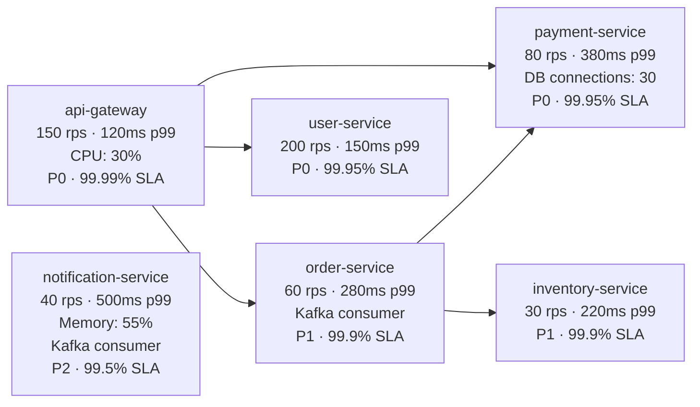

| Service | Team | Criticality | SLA | Common Failure Modes |
|---|---|---|---|---|
| `api-gateway` | platform | P0 | 99.99% | CPU saturation, latency spike, error rate spike |
| `payment-service` | payments | P0 | 99.95% | DB connection exhaustion, latency spike (DB timeout) |
| `order-service` | commerce | P1 | 99.9% | Kafka consumer lag, error rate spike, cascade from payment |
| `user-service` | identity | P0 | 99.95% | Deployment failure, latency spike |
| `inventory-service` | commerce | P1 | 99.9% | CPU saturation, dependency outage |
| `notification-service` | platform | P2 | 99.5% | Memory leak (OOM), Kafka consumer lag |

---

## 20. Failure Scenarios

The event simulator injects 7 realistic production failure patterns on a randomised schedule:

| Scenario | Target | Peak Value | Baseline | Duration | Kafka Event |
|---|---|---|---|---|---|
| `LATENCY_SPIKE` | payment-service p99 | 7,380ms | 380ms (19×) | 4 min | — |
| `ERROR_RATE_SPIKE` | order-service errors | 45% | 0.5% | 3 min | — |
| `CPU_SATURATION` | api-gateway CPU | 97% | 30% | 5 min | — |
| `MEMORY_LEAK` | notification-service | 98% | 55% | 6 min | — |
| `DB_CONNECTION_EXHAUSTION` | payment-service DB pool | 100/100 | 30 | 3.3 min | — |
| `KAFKA_CONSUMER_LAG` | order-service lag | 50,000 msgs | 100 | 5 min | — |
| `DEPLOYMENT_FAILURE` | user-service error rate | 40% | 0.5% | 4 min | `raw.deployments` |

Each scenario:
1. **Ramps gradually** using `_gradual()` — simulates real-world progression, not instant spike
2. **Injects correlated error logs** matching the failure type (e.g., "Connection pool exhausted: timeout waiting...")
3. **Auto-recovers** after the scenario duration, triggering the resolution monitor
4. **Publishes a deployment event** for `DEPLOYMENT_FAILURE` to exercise deployment correlation logic

---

## 21. Technical Highlights

<details>
<summary><strong>Distributed Systems Design</strong></summary>

- **9-topic Kafka pipeline** — each agent is independently deployable, independently scalable, independently replayable
- **Consumer group isolation** — detection, correlation, and investigation agents each maintain independent Kafka offsets; one slow agent never blocks another
- **Backpressure by design** — Kafka absorbs burst load; agents process at their own rate without coordination
- **Health-check dependency chains** in Docker Compose — no agent starts until its upstream infrastructure reports healthy; eliminates startup race conditions
- **Dedup via Redis SET NX** — atomic deduplication prevents alert storms without distributed locking complexity
- **Hysteresis in resolution monitor** — 3 consecutive normal readings required before declaring resolved; prevents flap on noisy recovery

</details>

<details>
<summary><strong>AI Orchestration & Tool Use</strong></summary>

- **Agentic loop from scratch** using the Anthropic SDK — no LangChain, no framework; full control over the reasoning loop, tool routing, and error handling
- **Dynamic tool selection** — Claude decides which tools to call and in what order based on cumulative evidence
- **Structured output enforcement** — `submit_rca` tool schema requires `confidence` (float), `evidence[]` (list), `all_candidates[]` (ranked); prevents hallucinated outputs
- **Model tiering** — Haiku for latency-sensitive per-message classification, Sonnet for deep reasoning; cost-optimised at scale
- **Deterministic fallbacks** — every LLM call has a rule-based fallback ensuring the pipeline never blocks on a model failure

</details>

<details>
<summary><strong>RAG & Vector Search</strong></summary>

- **Multi-collection Qdrant design** — incidents, runbooks, architecture stored separately with different retrieval strategies per use case
- **Multi-angle chunking** — each incident produces 4 semantically distinct chunks (summary / root_cause / resolution / factors); maximises recall from different query types
- **Same embedding model at ingest and query time** — seeder and agents both use `all-MiniLM-L6-v2` loaded in-process; no embedding drift
- **Filtered search** — `FieldCondition` on `anomaly_type` before cosine ranking narrows the search space for higher precision
- **De-duplication of results** — when multiple chunks from the same incident match, keep the best-scored one; present incidents not chunks

</details>

<details>
<summary><strong>Observability & Reliability Engineering</strong></summary>

- **Full audit trail** — every agent action persisted to `agent_events` with timestamp; postmortem reconstructs the exact timeline from the DB, not from memory or logs
- **Statistical anomaly detection** — z-score over a 50-sample rolling window per service+metric; adapts to each service's normal operating range; no manual threshold tuning
- **Multi-signal correlation** — three independent signals (deployment timing, cascade failure, upstream degradation) combined before LLM reasoning; reduces false positives
- **Background resolution monitor** — daemon thread in the investigation agent; polls Redis every 30s; hysteresis prevents flap; MTTR calculated at millisecond precision
- **Prometheus + Grafana zero-config** — datasource and dashboard provisioned at Grafana startup via volume mounts; no manual setup required

</details>

<details>
<summary><strong>Production Code Quality</strong></summary>

- **Pydantic models for all Kafka events** — strict typing across the entire pipeline; malformed events are logged and skipped without crashing the consumer
- **Shared library pattern** — `shared/` module eliminates duplication of Kafka client, Redis client, DB pool, and LLM wrapper across 6 agents; single source of truth for retry logic
- **Graceful degradation** — every external call (Qdrant, Redis, PostgreSQL, Anthropic) wrapped with try/except; error text returned to Claude as a tool result; Claude continues reasoning
- **Connection pooling** — `ThreadedConnectionPool` in the DB client; Qdrant and Redis clients initialised once per agent at startup; no per-request overhead
- **Resource constraints** — Redis configured with `maxmemory 512mb` and `allkeys-lru` eviction; Kafka log retention set to 7 days; no unbounded growth in demo

</details>

<details>
<summary><strong>Autonomous Decision-Making</strong></summary>

- **No human in the loop required** — from raw metric to blameless postmortem in ~3 minutes with zero manual steps
- **Evidence-driven reasoning** — `submit_rca` tool requires Claude to list explicit `evidence[]` items per hypothesis; prevents unsupported conclusions
- **Confidence-aware communication** — email subject line includes the confidence percentage ("87% Confidence") so the on-call can calibrate trust immediately
- **Role-based escalation** — CRITICAL incidents CC management automatically; HIGH severity goes to on-call and team; postmortems always go to all three roles

</details>

---

## 22. Roadmap

### Near Term
- [ ] **Human-in-the-loop approval gate** — pause before executing `IMMEDIATE` remediation steps; on-call approves via Slack button or API call
- [ ] **PagerDuty integration** — replace Mailhog with real PD incidents; auto-acknowledge on resolution
- [ ] **Slack bot** — post incident updates to `#incidents` with interactive approve/reject buttons
- [ ] **EWMA baselines** — replace simple z-score with exponentially weighted moving average for faster baseline adaptation

### Medium Term
- [ ] **Self-learning knowledge base** — automatically ingest resolved incidents into Qdrant after postmortem review; system improves with every incident
- [ ] **OpenTelemetry traces** — instrument LLM calls and Qdrant searches with distributed tracing; per-incident latency breakdown
- [ ] **Kubernetes operator** — CRD-based agent deployment; HPA on CPU and Kafka consumer lag
- [ ] **Cost tracking** — log tokens used and Anthropic cost per incident to PostgreSQL; report cost-per-MTTR-minute

### Long Term
- [ ] **Predictive anomaly detection** — LSTM / Prophet model for forecasting anomalies before threshold breach
- [ ] **Automated remediation execution** — agent calls kubectl / AWS API / Terraform after human approval
- [ ] **Error budget alerting** — multi-window SLA burn-rate alerts replacing raw metric thresholds
- [ ] **Cross-incident clustering** — group concurrent anomalies sharing a root cause into a single incident record

---

<details>
<summary><strong>Full Tech Stack</strong></summary>

| Layer | Technology | Version |
|---|---|---|
| LLM — reasoning | Anthropic Claude Sonnet | 4.6 |
| LLM — classification | Anthropic Claude Haiku | 4.5 |
| Embedding model | `all-MiniLM-L6-v2` (local) | SentenceTransformers 2.x |
| Vector store | Qdrant | v1.8.0 |
| Message bus | Apache Kafka (Confluent) | 7.5.3 |
| State database | PostgreSQL | 15-alpine |
| Cache / dedup | Redis | 7-alpine |
| Metrics | Prometheus | v2.49.0 |
| Dashboards | Grafana | 10.2.3 |
| Email capture | Mailhog | v1.0.1 |
| API framework | FastAPI | — |
| Template engine | Jinja2 | — |
| Event validation | Pydantic | v2 |
| Container runtime | Docker Compose | v3.8 spec |
| Language | Python | 3.11 |

</details>

---

*Built to demonstrate autonomous AI systems, event-driven microservice architecture, and production SRE practices at Staff Engineer level.*
